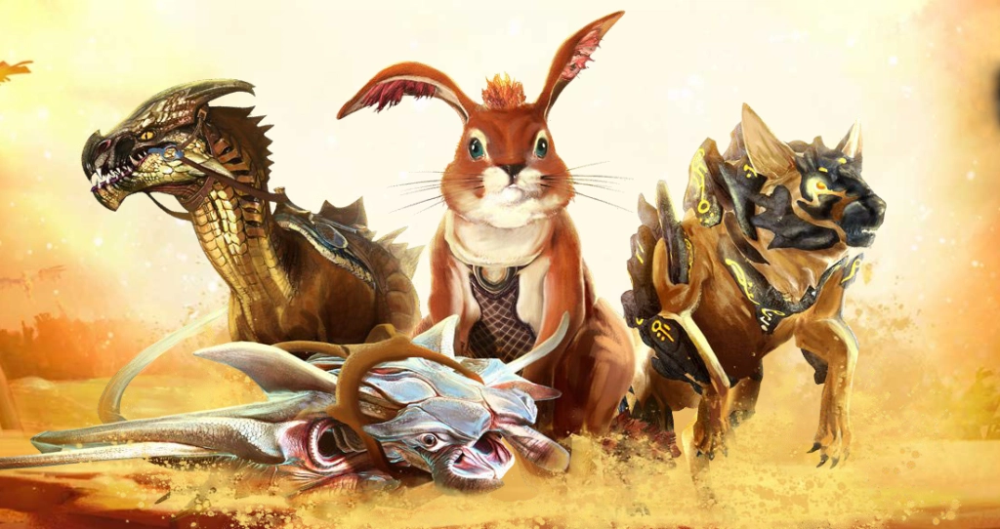

## Başlarken

---

Diğer MMO'ların aksine, Guild Wars 2'deki binekler çevre ile oldukça etkileşimlidir. Her bineğin araziyi aşmak için özel bir amacı ve kendi sınırlamaları vardır, bu da Tyria dünyasını elde edildikten sonra hala heyecan verici ve maceracı hissettirir.



Raptor testi yapın!

- Genişletme kilidi açılmış hesaplara, tek bir karakterde 10.seviyeye ulaştıktan sonra temel raptor bineğine kalıcı erişim verilecektir. 80.seviyeye ulaşan ve Guild Wars 2: Path of Fire genişletme paketine sahip olan oyuncular bu bineğin Mastery'lerini açabilir.
- Ücretsiz hesaba sahip karakterler, 10.seviyeye ulaştıklarında 10 saatlik bir raptor bineği denemesi alacak.
- Halihazırda 10.seviyenin üzerinde olan ve ilk kilit açma yerini kaçıran karakterler için, her 10 seviyede bir kilit açma izni vermeye çalışacağız. Bu, hem Ücretsiz, hem de ek paket alan hesaplar için geçerlidir. Bu geri dönüş çözümüne yakalanmayan oyunculara bu kilidi açmak için ek yöntemler üzerinde çalışıyoruz.



<iframe width="560" height="315" src="https://www.youtube.com/embed/JA6NSZNPMR0?si=04zkKvH9b19izfkq" title="YouTube video player" frameborder="0" allow="accelerometer; autoplay; clipboard-write; encrypted-media; gyroscope; picture-in-picture; web-share" allowfullscreen></iframe>

Guild Wars 2'de binek toplamaya başlamak için **Path of Fire genişletme paketini satın almalısınız**. Path of Fire hikayesini oynamak için 80.seviyede bir karaktere sahip olmanız gerekir, ancak bu ek paketi satın almak size 80 seviye yükseltme eşyası sağlar. 80.seviye bir karaktere sahip olduğunuzda, kahraman panelinizin hikaye günlüğünü açarak başlayın.

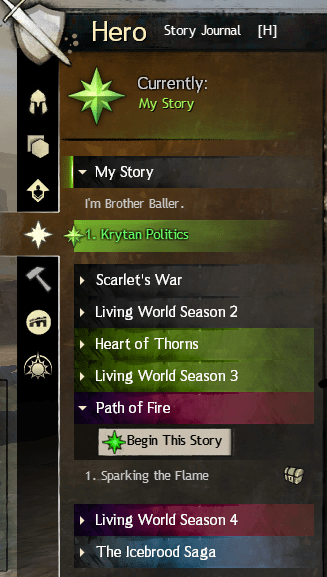

Sadece Path of Fire hikayesini oynayarak Raptor, Springer ve Skimmer'a sahip olacaksınız. Diğer binekler isteğe bağlıdır, ancak birçok avantajı vardır. Jackal bineğini, hikayenin ilerleyen bölümlerinde elde edilebilirsin. Gerisi ayrı rehberlerde ele alınacaktır. Diğer binek satın alma rehberleri için şu bağlantıları kullanabilirsin:

- [Griffon Rehberi](../griffon)
- [Roller Beetle Rehberi](../roller-beetle)
- [Warclaw Rehberi](../warclaw)
- [Skyscale Rehberi](../skyscale)
- [Siege Turtle Rehberi](../siege-turtle)

Her binek, kahraman panelindeki mastery sistemi kullanılarak geliştirilebilir. Bu, binek almak için önemlidir, çünkü bazı binek görevlerini tamamlamak için diğerlerinin geliştirilmiş sürümlerine ihtiyacınız olacaktır. Bu mastery'lerin seviyesini yükseltmek için, seviye 80 olan bir karakterde deneyim kazanmanız ve ardından bu mastery'i tamamlamak için deneyim çubuğunu doldurduktan sonra mastery puanları harcamanız gerekir.

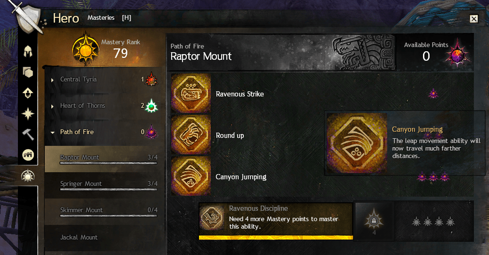

Mastery puanları, mastery puanı veren belirli başarımları tamamlayarak veya bunları harita üzerinde belirli konumlarda bularak kazanılabilir. **Mastery'ler ve Binekler hesaba bağlıdır**, yani tüm karakterlerinizin onlar üzerinde aynı ilerlemeye erişimi vardır.

## Raptor

---

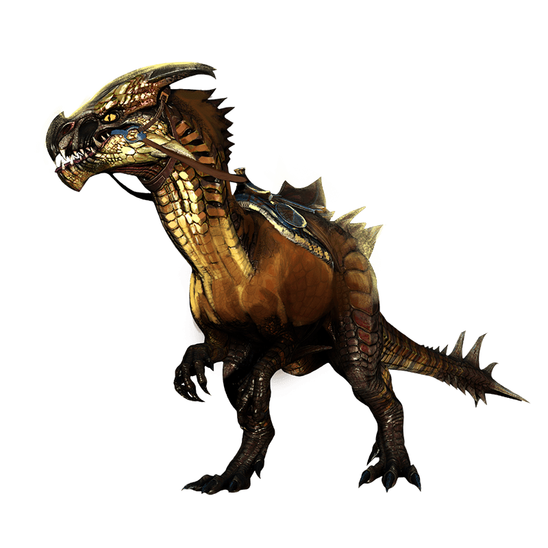

Raptor, kanyonlar ve vadiler gibi büyük boşluklardan atlamanıza olanak sağlar. Bineğin kullanılabilir yeteneği, bir alan toplama yeteneğidir ve düşmanları toplamak için çok iyidir.

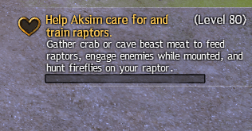

Path of Fire'daki ilk hikaye instance'ı, raptor'a erişim sağlayacaktır. Bu instance içinde bir kalp görevini tamamlamanız gerekir. Bu, Raptor bineğine anında erişim sağlayacaktır. Görevi tamamlamak için eğitmenden bir Raptor ödünç almalı ve onunla belirli aktiviteler gerçekleştirmelisiniz. **Kalp görevini tamamlamak size kendi Raptor Bineğinizi verir.**

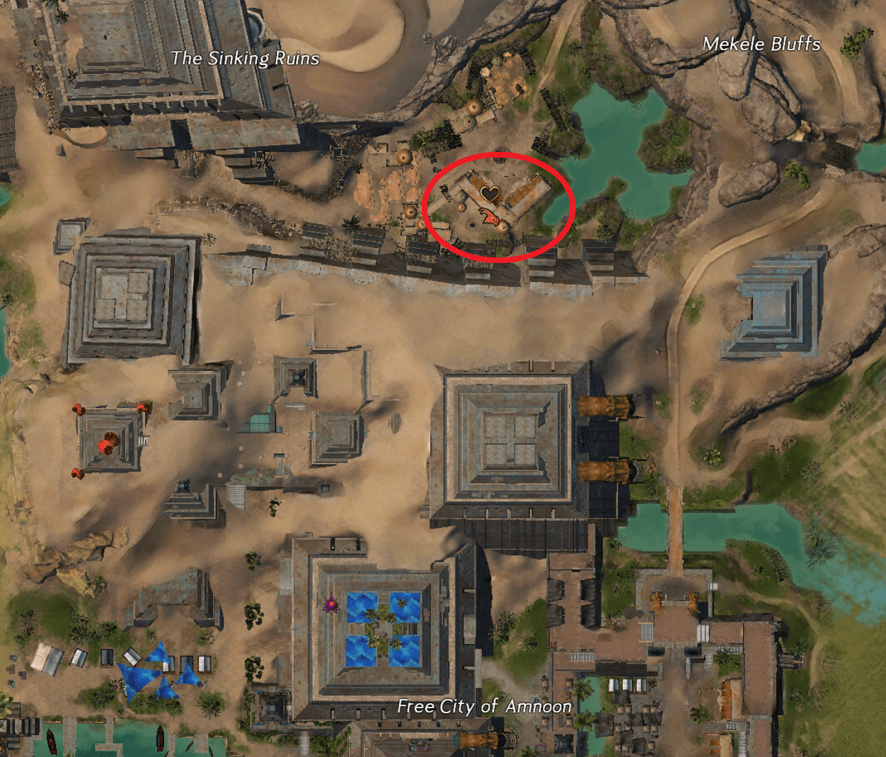

## Springer

---

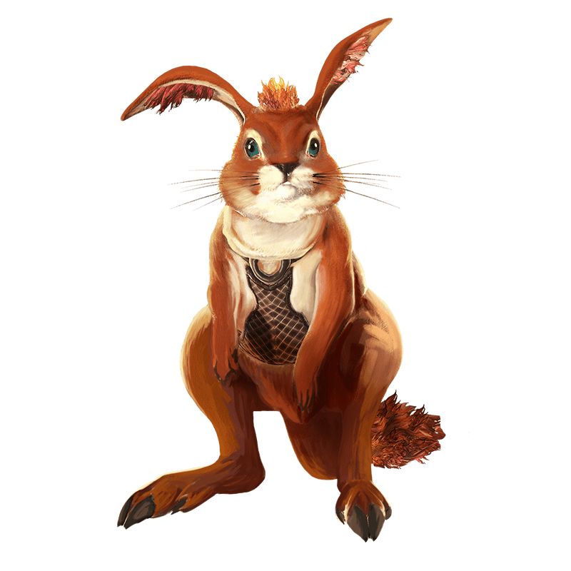

Raptor harika bir yatay hareket sağlarken, Springer dikey hareketler için harikadır. Raptor'un ulaşamayacağı yüksek yerlere ulaşabilir, ancak raptor'dan çok daha yavaştır. Ayrıca düşme hasarına karşı dirençli olmayı öğrenerek daha yüksekten düşmelerde hayatta kalmanızı sağlar.

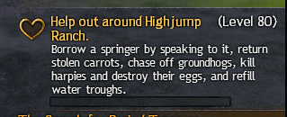

Springer'ı elde etmek için Canyon Jumping mastery'sine sahip Raptor bineğine sahip olmalısınız. Bu, Raptor'a veriler 5 mastery puanı gerektirir. Path of Fire hikayesinde Desert Highlands'e vardığınızda, Springer Ranch'e ulaşmak için geliştirilmiş raptor ile Highjump Gap'i - `[&BLUKAAA=]` geçmelisiniz. **Springer Bineği'ni almak için Springer Ranch'deki kalp görevini tamamlayın.**

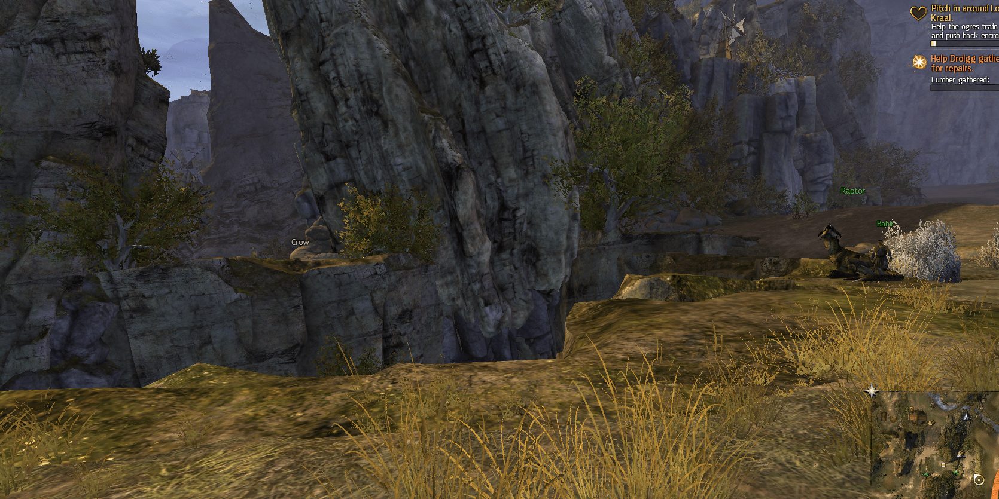

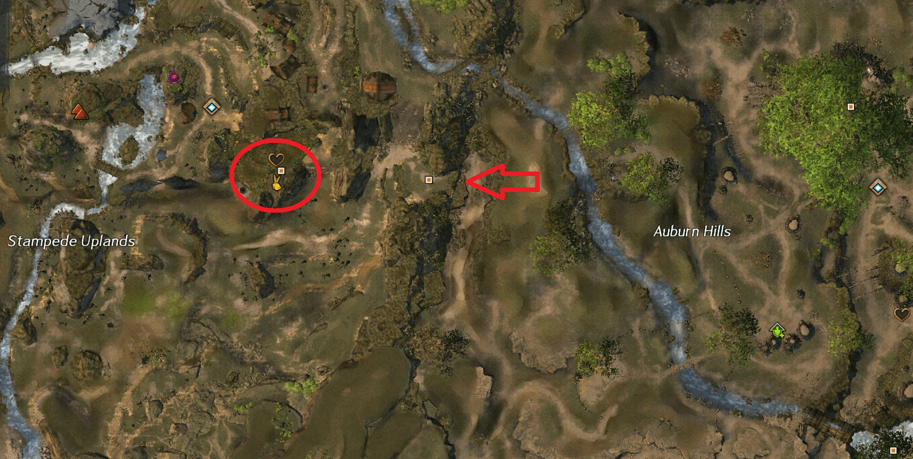

Springer'ın yeteneği havaya sıçramaktır. Daha yükseğe zıplamak için daha uzun süre bekleyebilir ve daha fazla dayanıklılık harcayabilirsiniz, ancak dayanıklılık, Springer için asla bir sorun değildir çünkü siz yere inmeden önce her zaman tam olarak şarj olur ve zıplama yeteneğini tekrar kullanmayı deneyebilir. Dayanıklılık, yalnızca zıplamanızın ne kadar yükseğe çıkacağının bir ölçüsüdür. Yatay olarak daha ileri gitmek için zıplamanızı şarj ederken ileri hareket tuşunu basılı tutun ve daha dikey gitmek için zıplama tuşu dışında hiçbir şeye basmayın.

## Skimmer

---

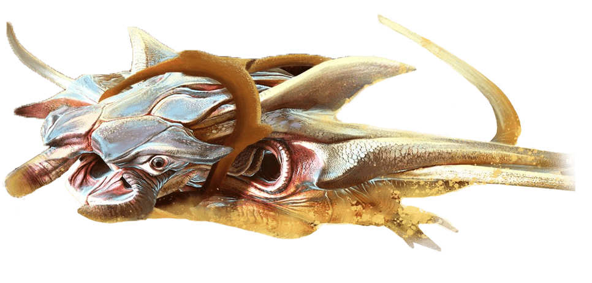

Skimmer, herhangi bir harekette özelleşmiş değildir, ancak çok yönlüdür. Yerin üzerinde süzülür ve suda yüzmekten çok daha hızlı süzülmenizi sağlar. Bataklık kumu ve kükürt çukurları gibi çevresel tehlikelerin de üzerinden süzülerel hasarı önleyebilirsiniz. Ayrıca yere asla temas etmediği için düşme hasarına karşı doğal olarak bağışıklıdır.

Skimmer aynı zamanda en dayanıklı binektir çünkü, Jackal mastery'si ile iyi bir kaçış aracına dönüşebilir ve Skimmer yeteneği yönlendirmeli bir yetenektir, bu nedenle süzülme süresi diğerlerinden çok daha uzun ve kontrol edilebilir. Bu, Skimmer'ı kullanarak çok daha tehlikeli yerleri barış içinde geçmenizi sağlar.

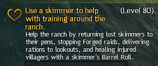

Skimmer'ı elde etmek için, Path of Fire hikayesinde Elon Riverlands'e gittiğiniz noktaya ulaşmanız, ardından Skimmer Ranch'e gitmeniz yeterlidir – `[&BGcKAAA=]` Skimmer bineğini almak için kalp görevini orada tamamlayın.

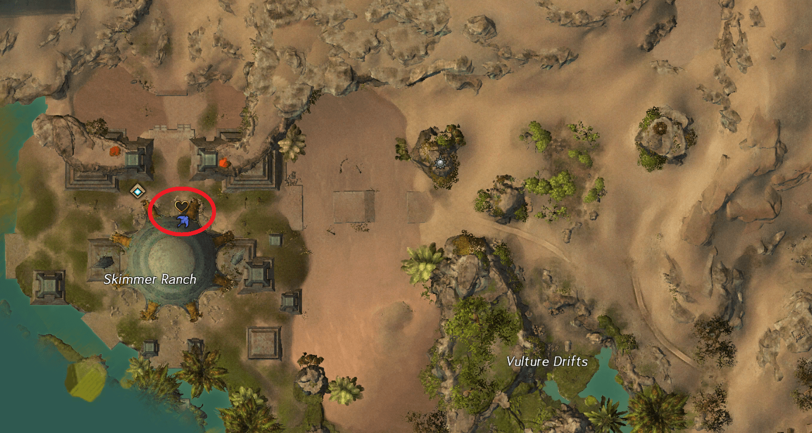

Binek yeteneği, Skimmer'ın havada daha yükseğe uçmasını sağlar ve Ride the Wind mastery'si ile daha da yükseğe süzülür. Bu, yolda daha az engel olacağından daha yumuşak bir sürüş sağlar. Ayrıca Skimmer'ın binek yeteneğini kullanırken zamanla daha az yükseklik kaybetmesi nedeniyle uzun mesafeli atlamalarda süzülmesine olanak tanır. Skimmer su, bataklık veya kükürt üzerinde yüzerken normalden daha hızlı hareket eder.

## Jackal

---

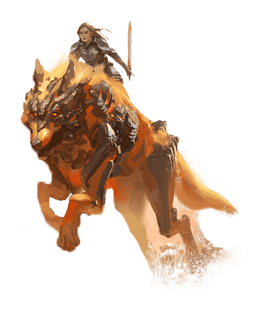

Path of Fire hikayesinin bir parçası olarak Jackal'ı elde etmeye gerek yok, bu yüzden onu elde etmek biraz araştırma gerektirecek. Kullanım açısından Raptor'a benzer. Raptor'dan biraz daha yavaştır, ancak daha iyi dönüşe sahiptir ve boşluklardan daha hassas bir şekilde sıçrayabilir. Jackal, Shifting Sands mastery'si ile Sand Portal'larda da seyahat edebilir. Bu, yeni alanlara ve kısayollara erişim sağlar.

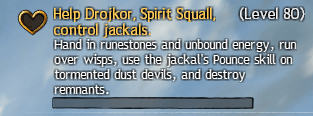

Jackal'ı elde etmek için The Desolation'ın güneybatı köşesindeki Sand Jackal Run'a – `[&BHcKAAA=]` gidin. Bunun için Skimmer bineğine ihtiyacınız var çünkü oraya ulaşmak için kükürt tarlalarını geçmelisiniz. Sand Jackal Run'ın doğusundaki izole platformun yanından süzülün. Oradan, merdiveni tırmanın ve Jackal bineğini elde etmek için üstteki kalp görevini tamamlayın.

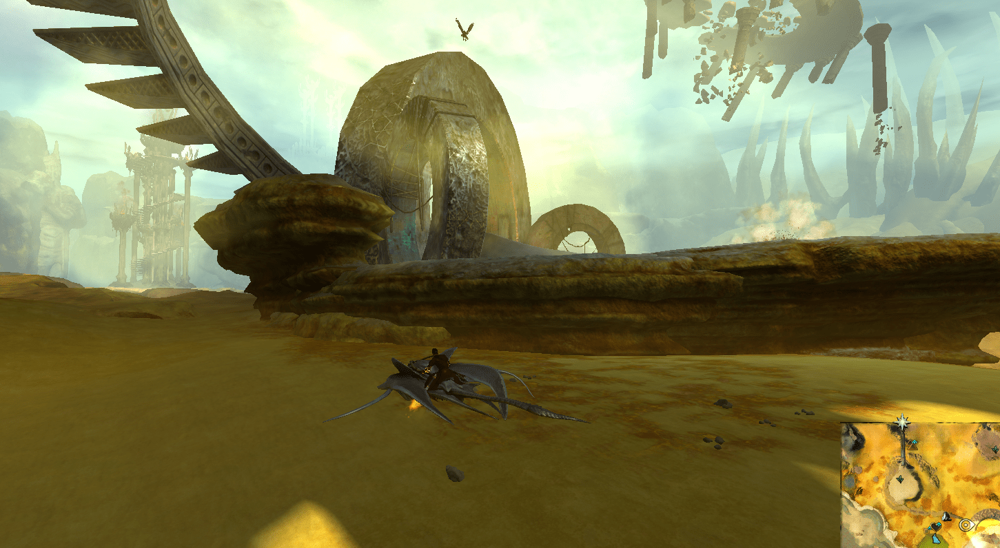

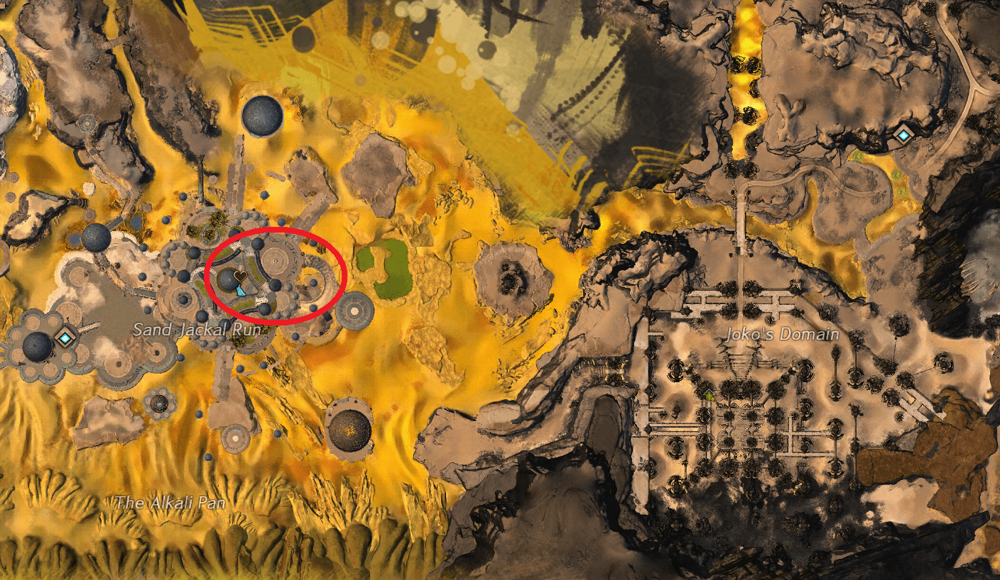

Jackal'ın Bolster Allies mastery'si ile kullanılabilir yeteneği, çevredeki ddostlara bariyer sağlar ve bu, bazı zorlukları tamamlamak için yararlıdır. Binek yeteneği Blink, Jackal'ın baktığı yöndeki bir yerdir. Jackal'ın baktığı yön hızlı bir şekilde değiştirilebilir, bu da oyuncunun virajlı araziyi daha kolay geçmesini sağlar. Jackal Blink ayrıca yerçekimi momentumunu da sıfırlayacaktır, bu nedenle oldukça uzak bir mesafeden düştükten sonra Blink'i kullanmak sizi düşme hasarından ölmekten kurtaracaktır.

## Crystal Champion Binek Mastery'leri

---

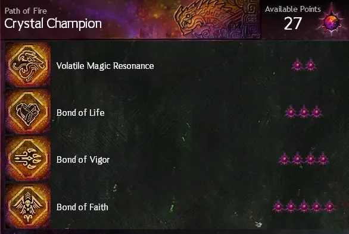

**Living World 4.Sezon**, oyuncunun tüm bineklerini daha da geliştirmek için daha fazla mastery'nin kilidini açmasına olanak tanır. Bu mastery'ler bir kez öğrenildiğinde, binek üzerindeyken kullanılabilecek yetenekler sağlar. Bunların kilidini açmak için, Sandswept Isles – Bölüm 2 hariç Living World 4.Sezon haritalarından herhangi birine girmelisiniz. Crystal Champion Binek Mastery'lerinin kilidini açmak için şu haritalardan birine girin:

- Domain of Istan – Bölüm 1
- Domain of Kourna – Bölüm 3
- Jahai Bluffs – Bölüm 4
- Thunderhead Peaks – Bölüm 5
- Dragonfall – Bölüm 6

### Bond of Life

---

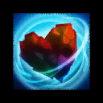

Bond of Life, bineğinizin sağlığını 10 saniyeliğine sizin sağlığınızla değiştirerek, tehlikeli bölgeleri binekten inmeden daha uzun süre gitmenizi sağlar. Dikkatli olun, bu süre içinde sağlığınız 0'a ulaşırsa, binekten inmek yerine direkt yere düşersiniz. Bu, Springer'ı tehlikeli alanlarda kullanmak ve bölgeden atlayana kadar yeterince uzun süre hayatta kalmak için iyidir.

### Bond of Vigor

---

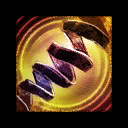

Bond of Vigor, kullanıldığında kısa bir süre içinde size büyük ölçüde dayanıklılık yenilemesi sağlar. Bu size Jackal ve Raptor'da ani bir hız kazandırabilir veya uçan bineklerde daha fazla yükseğe çıkmanıza izin verebilir.

### Bond of Faith

---

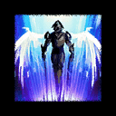

Bond of Faith, oyuncuların bir aksiyonun ortasında binekten inmelerine ve kendilerini yukarı fırlatmalarına olanak tanır. Bu, Springer'ın ulaşabileceğinden daha yüksek yüksekliklere ulaşmak veya ilgili bineğin mastery'lerini kullanarak havada uçan bir bineğe geçmek için iyidir.
