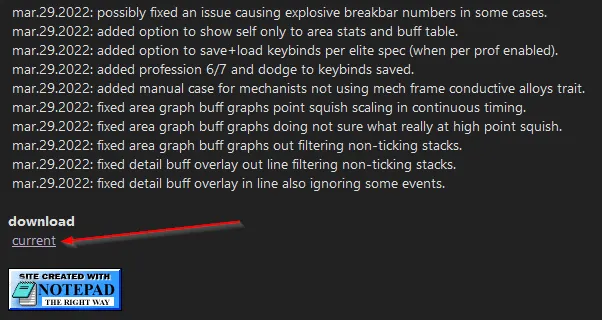
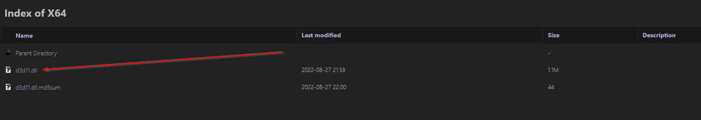
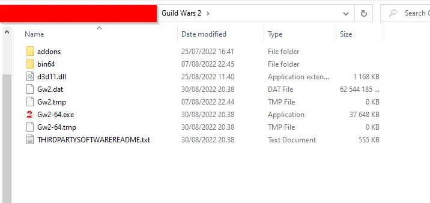
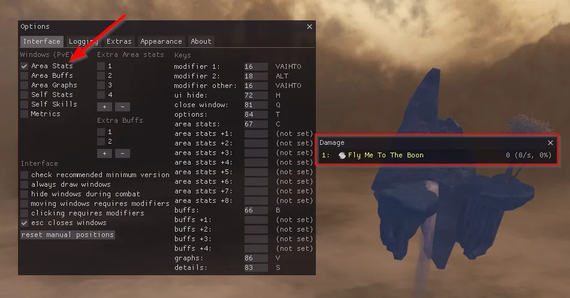
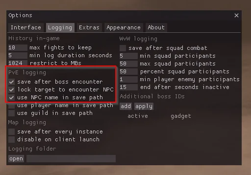
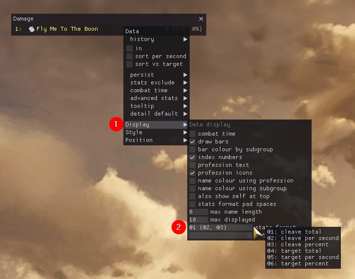
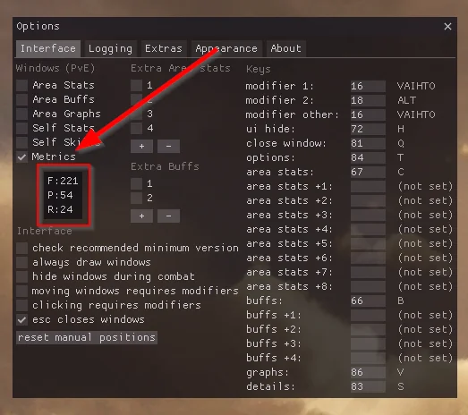

ArcDPS, deltaconnected tarafından geliştirilen üçüncü taraf bir eklentidir.

## ArcDPS nedir?

---

[ArcDPS](https://www.deltaconnected.com/arcdps/), deltaconnected tarafından geliştirilmiş bir eklentidir.

Örneğin, aşağıdaki bilgileri gösterir:

- Sizin ve grubunuzdaki veya squad'daki herhangi birinin savaş istatistikleri
- Giden hasar
- Gelen hasar
- Giden boon'lar
- Gelen boon'lar

ArcDPS'in gerçek zamanlı çizelgeleri (ve bu çizelgelerden üretilen kayıtlar) size raid, strike ve fractal gibi içerikler için temel araçları sağlar. Nasıl çalıştıklarını anladığınızda gelişmenize yardımcı olurlar!

ArcDPS şu anda Guild Wars 2 için izin verilen tek savaş analizcisidir (Resmi bir ArenaNet gönderisiyle 2017 Reddit başlığı [Archive.org bağlantısı](https://web.archive.org/web/20170917193052/https://www.reddit.com/r/Guildwars2/comments/5svug8/the_head_of_the_snake_devs_here_ask_us_anything/ddi77u2/)), ancak bu değişebilir.

Geliştiricinin web sitesinde belirtildiği gibi, bu yazılımı kullanırken "don't be a dick".

## ArcDPS Yükleme

---

1. [Resmi ArcDPS web sitesine](https://www.deltaconnected.com/arcdps/) gidin. Sayfanın altında, current'a tıklayın.

    
    
    _İndirme sayfası düğmesinin arcdps sayfasındaki konumu._

2. d3d11.dll'i indirin.
   
    

    _ArcDPS indirme sayfasındaki öğeler, ortadaki dosya -d3d11.dll, indirmeniz gereken dosyadır._

    Antivirüsünüz dosyanın tehlikeli olduğunu söyleyebilir. Bu yanlış bir önermedir ve güvenle göz ardı edilebilir.

3. Guild Wars 2 açıksa kapatın. İstemci ve oturum açma ekranının kapalı olduğundan emin olun.
4. Guild Wars 2 kurulum klasörünü açın. Windows 7+ işletim sistemleri için varsayılan konum genellikle "C:\Program Files (x86)\Guild Wars 2" şeklindedir.
5. Ana "Guild Wars 2" klasörüne d3d11.dll dosyasını ekleyin. Aşağıdaki resimdeki gibi bir şey görünmelidir.

    

    _ArcDPS'in kurulu olduğu Guild Wars 2 klasörü._

6. Guild Wars 2'yi başlatın ve bir karakterde oturum açın.
7. Eğer ArcDPS gözükmüyorsa menüsünden açabilirsiniz, (Alt+Shift+T) tuş kombinasyonları ile menüsünü açabilirsiniz. Veya Guild Wars 2 çökerse çözüm için [ArcDPS websitesine](https://www.deltaconnected.com/arcdps/) bakabilirsiniz.

ArcDPS menüsü görünmüyorsa, bu iki kısayol tuşu bu sorun için en yaygın düzeltmelerdir:

- ArcDPS'i gizlemek/göstermek için Alt+Shift+H tuşlarını kullanın.
- ArcDPS menüsünü gizlemek/göstermek için Alt+Shift+T tuşlarını kullanın.

## ArcDPS Ayarları

---

ArcDPS'i kurmadan önce, bir karaktere giriş yapın ve ArcDPS menüsünü açın.

1. Savaşta temel hasar istatistikleri için **Area Stats**'ı etkinleştirin.

    

    _ArcDPS menüsünün yanındaki etkin Area Stats penceresi_

2. Savaş kayıtlarını kaydetmek için, **Logging** altında, **save after boss encounters**, **lock target to encounter NPC** ve **use NPC name in save path** seçeneklerini etkinleştirin.

    

    _Logging menüsünde etkinleştirmek istediğiniz ayarlar._

3. Area Stats penceresinin kullanılabilirliğini artırmak için, Area Stats penceresine sağ tıklayın ve ardından **Display** sekmesinden **stats format** kısmını `@5, @6 (@2, @3)` olarak ayarlayın.

    * @1, Toplam cleave hasarı
    * @2, Saniyedeki cleave hasarı
    * @3, Cleave hasar yüzdesi
    * @4, Toplam hedef hasarı
    * @5, Saniyedeki hedef hasarı
    * @6, Hedef hasar yüzdesi, manasına gelir.

4. İstatistik biçimini istediğiniz gibi değiştirebilirsiniz, ancak tek hedefli DPS çoğu durumda görmek istediğiniz sayı olduğundan her zaman `@5`'i dahil edin.

    

    _Area Stats penceresinde görüntülenen istatistiklerin ayarlanması._

5. Ek bilgi için, ana ArcDPS menüsünde **Metrics**'i etkinleştirin.

    

    _ArcDPS menü penceresinin yanındaki Metrics penceresi._

**F = FPS**, **P = Ping**, ve **R = Server Tick Rate**. İdeal Sunucu Bağlantınız sabit ~25'tir. Çok daha yüksek veya daha düşükse, muhtemelen istemci tarafı yerine sunucu tarafı olabilecek paketleri kaçırıyorsunuzdur.

## ArcDPS Kayıtlarını Bulma

---

Kayıtlar varsayılan olarak "Belgeler\Guild Wars 2\addons\arcdps\" konumuna kaydedilir.

## ArcDPS'i Kaldırma

---

Guild Wars 2 güncellemelerinden sonra, ArcDPS oyunu çökertmeye başlayabilir. Yeni bir ArcDPS güncellemesi yayınlanana kadar ArcDPS'yi kaldırabilirsiniz.

1. Guild Wars 2 kurulum klasörünü açın. Genellikle “C:\Program Files (x86)\Guild Wars 2” gibi bir klasördür.
2. d3d11.dll'i silin. Alternatif olarak, ArcDPS'i "d3d11.dll.bak" olarak yeniden adlandırarak devre dışı bırakın. Yeniden etkinleştirmek için ad değişikliğini geri alın.



## ArcDPS Eklentileri

---

ArcDPS, onu daha da iyi yapan birkaç eklentiye sahiptir. Yüklemek için DLL'lerini ArcDPS ile aynı klasöre bırakın.

- [Boon Table](https://github.com/knoxfighter/GW2-ArcDPS-Boon-Table): Boon'ları kolay okunabilir bir formatta gösterir. ArcDPS'deki varsayılan boon tablosunu okumak zordur. Boon Tablosunu gizlemek/göstermek için **Alt+Shift+B** tuşlarını kullanın.
- [Mekanik Log](https://github.com/knoxfighter/GW2-ArcDPS-Mechanics-Log): Raid mekaniklerini izler ve bunları kolayca okunabilir bir çizelgede gösterir. Ancak unutmayın, bu eklentiyi kullanan bir pislik olmayın. Mekanik Log'u gizlemek/göstermek için **Alt+Shift+L** tuşlarını kullanın.
- [Healing Stats Addon](https://github.com/Krappa322/arcdps_healing_stats): Yerel istatistiklere (oyundaki savaş kayıtları) dayalı olarak healing çıkışıyla ilgili istatistikleri gösterir. Ayrıca bu bilgiyi ArcDPS tarafından oluşturulan kayıt dosyasına da ekler.
- [Clears Addon](https://github.com/gw2scratch/arcdps-clears): Hafta boyunca nereleri temizlediğinizi basit ve şık bir pencerede gösterir.
- [Unofficial Extras Addon](https://github.com/Krappa322/arcdps_unofficial_extras_releases): Temel ArcDPS'e belirli işlevler ekler, kendi başına bir işlevi yoktur.
