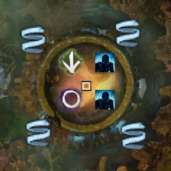
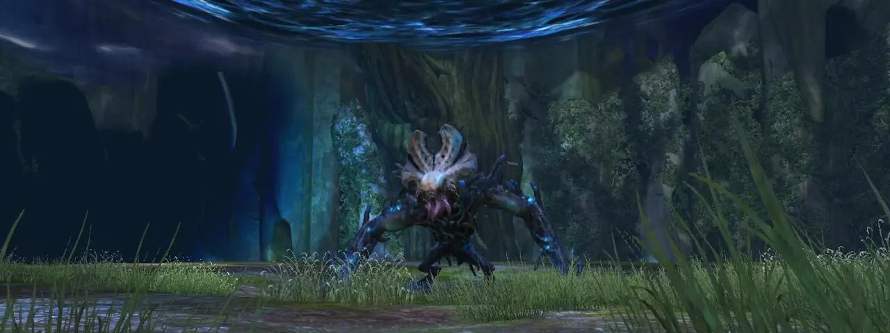
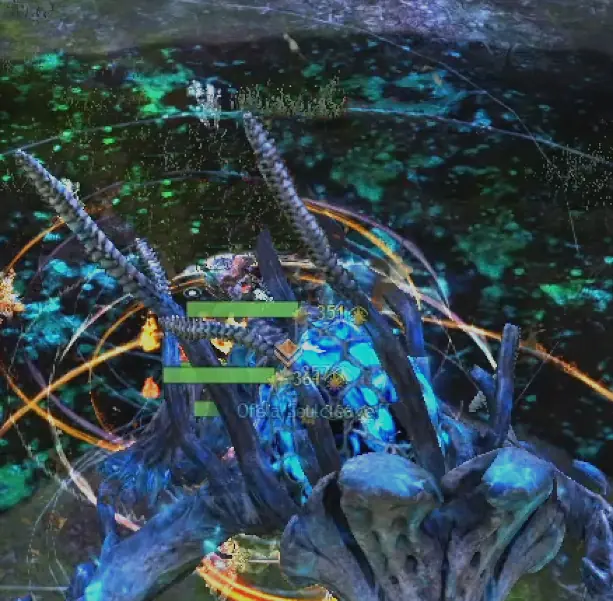
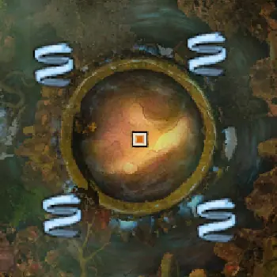
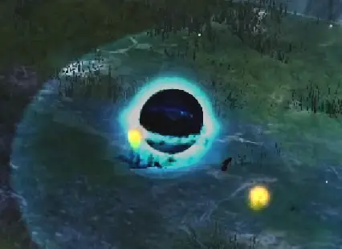
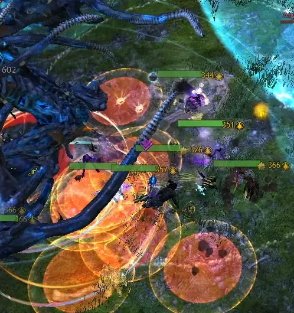

Gorseval the Multifarious ("Gorseval" veya "Gors(e)"), Spirit Vale(Wing 1)'in ikinci bossudur. Öfke nöbetlerini ve dünyevi açlığı durdurmak için yüksek DPS ve ağır CC getirin veya herkesi tüketmeden önce arenadan kaçın. Bölünmüş aşamaları sırasında, Yüklü Ruhlarını(Charged Souls) onunla birleşmeden önce öldürerek açlığını yeniden uyandırın. Büyüyen karanlığa dokunmaktan kaçının veya içinde saklı ışığı arayın. Yumurtlamayın!

## Gorseval İle Savaşmadan Önce

---

- Gerekli Mastery ve Binekler

    * (herkes için) "Updraft Use" Mastery
    * Binek gerekmiyor

- Özel Roller

    * 1 Tank: Gorseval, en yüksek Toughness'a sahip oyuncuya saldırır.

- Genel Stratejiler

    * CC Hızı (“hızlı CC”, “yavaş CC”, “CC atmayın”) 
        * Takım DPS'i, öfke nöbeti (Ghastly Rampage) sırasında CC'den etkilenir ve daha hızlı CC'atmak World Eater'dan önceki DPS süresini azaltır.
        * *hızla kırılan* (takım DPS'i >75k; "hızlı CC")
        * *yavaş kırılan* (takım DPS'i <75k; "yavaş CC")
        * Örnekler:
            * "hızlı/hızlı/yavaş": ilk aşama = hızlı CC, ikinci aşama = hızlı CC, son aşama = yavaş CC
            * “hepsi yavaş”: tüm aşamalar yavaş CC
            * “hızlı CC”: tüm aşamalar hızlı CC
    * World Eater ile Başa Çıkmak
        * Takım DPS'i, World Eater saldırısını bitirmeden önce durdurmanızı veya ondan kaçmanızı etkiler.
            * *yoksay* ve *yüksek DPS*: DPS Gorseval'i %66/%33/%0'a düşürerek durdurur.
            * *arenadan kaçış*: Updraft'ın yanındaki Ethereal Barrier'i (“bariyer”, “duvar”) öldürün ve ardından arenadan süzülerek çıkın.
    * Charged Souls ile Başa Çıkmak
        * Takım DPS'i, Charged Souls'u öldürmek için alt gruplara ayrılmadan dolayı etkilenir.
            * *saat yönünde dönerek* (DPS düşük ise): ==Immobilize== becerisine sahip oyuncular, güneydeki Charged Soul'u durdururken, takım kuzeybatıyı (yeşil işaret) öldürür ve saat yönünde döner. Entangle ile bir Druid kullanmak yaygındır, ancak gerekli değildir.
            * *ayrılarak* (DPS yüksek ise): ==Immobilize== becerilerine sahip oyuncular, alt grupları batıdaki (yeşil işaret) Charged Soul'u öldürürken doğudaki Charged Soul'u durdurur. Alt grup 1, kuzeybatı (yeşil işaret) → kuzeydoğu'daki ruhları öldürür öldürür. Alt grup 2, güneybatı (mor işaret) → güneydoğu'daki ruhları öldürür. Önce bitiren alt grup diğer alt gruba yardımcı olur.

- Skill Değişimleri

    * Immobilize skilleri: Bölünme aşamaları sırasında ruhları durdurmak için.
    * CC skilleri: Öfke nöbeti sırasında Gorseval'in Breakbar'ını kırmak için (Ghastly Rampage).
    * (opsiyonel) Aegis veya Stability skilleri: Çarpmanın (Spectral Impact) yere düşürmeye neden olmasını engeller.
    * (opsiyonel) diğer soft-CC becerileri (Chill, Cripple, and Slow): Immobilize, ruhları durdurmak için en iyisi olsa da, hareket eden ruhları yavaşlatmak önemlidir.

### Charged Soul ve Ethereal Barrier Konumlarını İşaretleme

---

Ruhlar ve Bariyer için konum işaretleri

Charged Souls'u öldürmeye nereden başlayacağınızı bulmak için konum işaretçilerini kullanın:

- Ok (Yeşil İşaret): Gorseval'in kuzeybatısı.
- (opsiyonel) Daire (Mor İşaret): Gorseval'in güneybatısı. Ruhları alt gruplar olarak öldürmek, Alt Grup 2'nin batıdaki Ruhlarını bulmasına yardımcı olur.

Eğer World Eater'dan kaçıyorsanız, toplam 4 işaret kullanın. İsteğe bağlı olmakla birlikte, doğru Bariyeri kesmeyi kolaylaştırırlar. Arrow ve Circle'a ek olarak konum işaretçileri koyun:

- Kalp (Kırmızı İşaret): Gorseval'in kuzeydoğusu.
- Kare (Mavi İşaret): Gorseval'in Güneydoğusu.

## Boss 1.Aşama (%100–%66)

---

Gorseval

Spirit Woods'un sonundan Updraft ile platforma uçun. Kenara yakın kalın, yoksa kavga başlar!

- Baştan başladıktan sonra Updraft'ın yeniden ortaya çıkmasını bekleyin, böylece düşüp ölmezsiniz!



Dövüş başladığında, birinci veya ikinci saldırısı olarak, Gorseval kolunu yere vurarak sizi ittirip yere düşürür. Dodge atın veya Aegis/Stability becerilerini kullanın.

- Spectral Impact (“slam”): AoE Knockback becerisi. Gorseval kolunu yere vurarak orta düzeyde hasar verir.
- Şamarlama ("swipe"), otomatik saldırısıdır ve sizi şamarlar. Knockback atmaz.

3 saldırının ardından Gorseval, arenanın merkezine ışınlanır ve sinir krizi geçirmeye başlayarak siyah yapışkan halkalar oluşturur.

CC stratejinizi takip edin ve kara yapışkan maddeden çıkın. Hızlı/çoklu vuruşlu saldırılar kullanmayın, yoksa kendinizi yere düşürürsünüz!

- Takım DPS'i beklenenden düşükse, komutanınızın yavaş CC emri vermesini veya World Eater'dan kaçmasını bekleyin!
- World Eater olayını atlamak için hayvan gibi DPS atmaya çalışıyorsanız, Gorseval'in Breakbar'ını çok hızlı kırmadığınızdan emin olun! DPS'i World Eater'ı durduracak kadar yapamazsanız, ölmeye mahkum olacaksınız!

### Ghastly Rampage ile Başa Çıkmak (“tantrum”, “rampage”, "siyah alan")

---

Ghastly Rampage: Oyuncu sağlığının %50'si kadar hasar verir. Gorseval ayrıca 4.500 Breakbar ve Vivid Echo(Gelen hasarı geri yansıtma) alır ve arenayı siyah halka desenleriyle kaplayarak orta düzeyde hasara neden olur ve patladığında Vulnerability biriktirir.

- Siyah alanlarda olmaktan kaçının. %50 HP için patlarlar ve yoğun bir şekilde Vulnerability biriktirirler.
- Hızlı/çok vuruşlu saldırılar kullanmaktan kaçının. Vivid Echo(Gelen hasarı geri yansıtma), vuruş başına sabit hasar verir, bu nedenle hızlı/çoklu vuruşlu saldırılar sizi kolayca yere serer.
- Condi hasarı Vivid Echo'yu tetiklemez.

Öfke nöbetinden sonra, Gorseval tekrar şamarlamaya ve yere vurmaya devam eder. Ayrıca, condi hasarına ve Knockback'e neden olan 4 tane eleman ortaya çıkarır.

- **Solo-Immobilizer** kullanıyorsanız, ayrılma aşaması başlamadan önce ortaya çıkan elemanları öldürün, aksi takdirde Entangle Charged Souls'u kaçırabilir.

Öfke nöbeti sona erdikten 25 saniye sonra Gorseval, World Eater'ı kullanmaya başlar.

Grubunuzun stratejisine bağlı olarak, ya mevcut aşamayı sonlandırarak DPS ile World Eater'ı geride bırakın ya da bundan kaçınmak için arenadan kaçın.

### World Eater ile Başa Çıkmak

---

World Eater: Gorseval'e iyi bir DPS atarak veya arenadan kaçarak kaçınılır. Saldırı başladıktan 13 saniye sonra oyuncuları ve ortaya çıkan elemanları öldürür. Öldürülen her eleman için Gorseval'in hasarı artar (öldürme başına +%10).

- Kullanılmış Updraft'lar yeniden ortaya çıkmadığından, World Eater'dan **yalnızca 4 kez kaçabilirsiniz**.

**World Eater'dan Kaçmak**

Updraft yerleri

İlk kişi kullandıktan 15 saniye sonra kaybolacağından, Updraft'ı kullanmak için bekleyin.

1. Öfke nöbetinden sonra, Updraft'a yakın rüzgardan duvar kesin.
2. Ortaya çıkan elemanları öldürün ve Gorseval'e DPS'e devam edin. Knockback yemeyin ve arenadan dışarı çıkmayın!
3. World Eater'ın etki alanı arenayı neredeyse doldurduğunda, Updraft ile glide atın ve bekleyin.
4. Ardından arenaya geri uçun.

World Eater'dan sonra Gorseval, saldırı düzenini mevcut aşamasının başından itibaren yeniden başlatır.

%66'da, Gorseval arenanın merkezine giderek hasar almaz bir hale gelir.

## 1.Bölünme Aşaması: Charged Souls

---

Ruhlar ve Bariyer için konum işaretleri

4 tane Ruh, arenanın etrafında doğar:

- kuzeydoğu
- güneydoğu
- güneybatı: Daire (Mor İşaret)
- kuzeybatı: Ok (Yeşil İşaret)

Ruhlar(Charged Souls), Gorseval'e doğru yürümektedir. Charged Soul, Gorseval ile birleştiğinde, World Eater(büyüyen ve ardından takımı öldüren turuncu çember) saldırısı başlar.

- Charged Souls, merkezinde sadece Gorseval ile birleşir. Gorseval'in çevresindeki balona dokunmak World Eater'ı başlatmaz.
- Charged Souls'un AoE'leri Weakness'a neden olmaktadır. Bu DPS ile ilgili bir sorun değildir.

Grubunuzun stratejisini izleyerek, Ruhları öldürün.

- Onları hızlı bir şekilde öldürmek için tam performans DPS attığınızdan emin olun!

### Ruhları Öldürmek

---

*Squad* olarak:

- Immobilize ve diğer soft-CC becerilerine sahip oyuncular, güneydeki Charged Soul'un hareket etmesini durdurur.
- Entangle kullanıyorsanız, Gorseval'in güney tarafında bekleyin. Entangle'ın ıskalaması durumunda başka Immobilize becerilerine/yardım çağrısına sahip olduğunuzdan emin olun.
- Saat yönünde hareket ederek KB (Ok, Yeşil İşaret) → GD → KD → GB'yı öldürün.

*Alt grup* olarak:

- Immobilize ve diğer soft-CC becerilerine sahip oyuncular, doğudaki Charged Soul'un hareket etmesini durdurur.
- Alt grup 1 KB (Ok, Yeşil İşaret) → KD'yu öldürür.
- Alt grup 2, GB (Daire, Mor İşaret) → GD'yu öldürür.
- Önce bitiren alt grup diğer gruba yardımcı olur.

4 Charged Soul'un tümü öldüğünde veya World Eater işini bitirdiğinde, Gorseval ikinci aşamasına başlar, artık hasar almaktadır.

## Boss 2.Aşama (%66–%33)

---

2.Aşama, 1.Aşama ile aynıdır, ancak Spectral Darkness ve farklı öfke nöbeti (Ghastly Rampage) modellerine sahiptir.

Menzilli saldırılarla yakındaki siyah küreleri öldürün, böylece etki alanları savaştığınız yeri kapsamaz. **Etki alanlarında durmayın!**

- Kafanızın üzerinde/buff barında hayalet simgesi = Gorseval'a zarar vermezsiniz. Debuff'ı kaldırmak için 2 altın küreyi (ölü siyah kürelerden ortaya çıkar) toplayın!
- World Eater'dan kaçıyorsanız, Updraft'ların yakınındaki siyah küreleri öldürün.

### Spectral Darkness ile Başa Çıkmak (“orbs”, “ghost”, "siyah toplar")

---

Spectral Darkness

Spectral Darkness: Arenada genişleyen açık mavi etki alanına sahip siyah kürelerdir. AoE'ye dokunmak, etkilenen oyuncuların kafalarının üzerinde bir hayalet simgesiyle birlikte 10 stack Spectral Darkness etkisi verir.

- Siyah küreleri öldürmek, 2 küçük altın küre ortaya çıkarır.
- Siyah küre AoE'lerine dokunmak sizi zayıflatır. Zayıflatma, DPS'nizi azaltır (-%100) ve alınan hasarı artırır (+%100)!
- Hayaletli oyuncular = World Eater bitmeden önce DPS ile skip yapanlar için daha az DPS. **Debuff'ı kaldırdığınızdan emin olun!**

%33'de, Gorseval arenanın merkezine giderek hasar almaz bir hale gelir.

## 2.Bölünme Aşaması: Charged Souls

---

2.Bölünme Aşaması, 1.Bölünme Aşaması ile aynıdır, ancak Spectral Darkness(Mavi Toplar) içerir.

4 Charged Soul'u öldürürken, yakındaki mavi küreleri uzaktan öldürdüğünüzden emin olun ve hayaletlenmemeye dikkat edin!

4 Charged Soul'un tümü öldüğünde veya World Eater işini bitirdiğinde, Gorseval üçüncü aşamasına başlar, artık hasar almaktadır.

## Boss 3.Aşama (%33–%0)

---

3.Aşama, 2.Aşama ile aynıdır, ancak Ghastly Prison(yumurta) ve farklı öfke nöbetleri (Ghastly Rampage) modellerine sahiptir.

Yumurtalara hapsolmamak için turuncu AoE'lerden çıkın. Diğer oyuncuların alanlarına girmemeye dikkat edin!

- Yumurtaya hapsolmuş kişileri kurtulmak/kurtarmak için:
    * (siz hapsolduysanız) 1.Skill yerine gelen skill'e sürekli basarak
    * (başkası hapsolduysa) Yumurtaları keserek

### Ghastly Prison'dan kaçınmak (“eggs”, “getting egged”, "yumurta")

---

Yumurta Alanları

Ghastly Prison(Yumurta Mahkumu): Oyuncuların altında küçük turuncu AoE daireleri görünür. 1 saniye sonra turuncu alan içerisinde olan oyuncular mavi yumurtalara hapsolur (“yumurtalı”).

- Kapana kısılmış oyuncular = World Eater'dan önce DPS için daha az zaman!

**Komutanınıza dikkat edin!** Takım DPS'i çok düşükse (çok fazla kişi hayalet veya yumurtalı ise), komutanınız öfke nöbeti için yavaş CC emri verebilir veya CC yapmayı durdurabilir ve World Eater'dan kaçmak için Ethereal Barrier'ı kırmaya başlayabilir.

%0'da Gorseval ölür ve dövüşü biter.

Bazen Gorseval öldükten sonra World Eater saldırısı tamamlanır ve siz de ölürsünüz. Yine de öldür ve ganimetini al!

## Örnek Video

---

<iframe width="560" height="315" src="https://www.youtube.com/embed/JxHldlzy0_c?si=govleDIhyfzw6Pq8" title="YouTube video player" frameborder="0" allow="accelerometer; autoplay; clipboard-write; encrypted-media; gyroscope; picture-in-picture; web-share" allowfullscreen></iframe>

