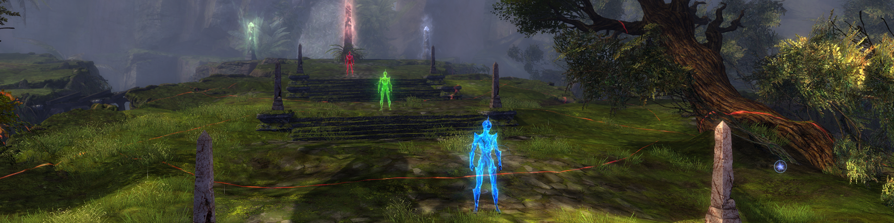
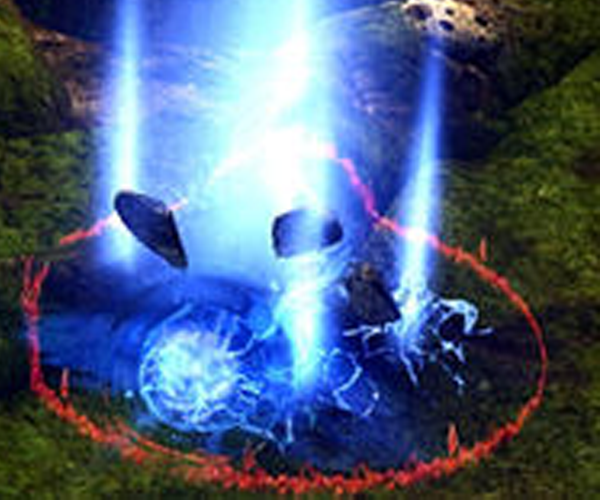
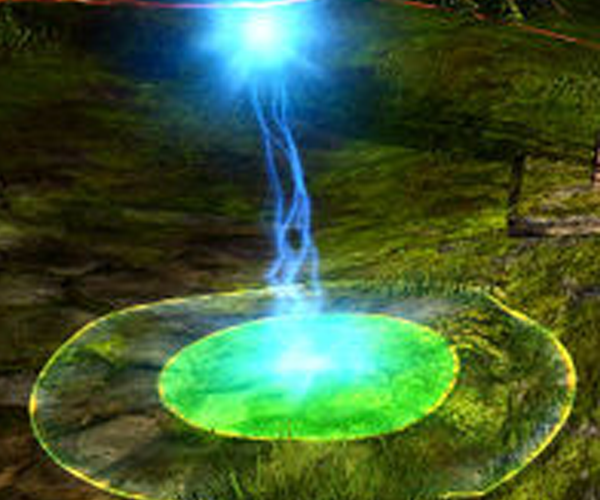
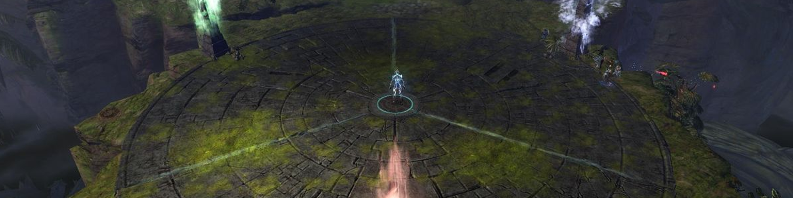

Vale Guardian (kısa adıyla "VG") Spirit Vale(Wing 1)'in ilk bossudur. Fakat ilk boss olması onun en kolay boss olacağı anlamına gelmiyor! Bol hareketlilik, mekanik ve kargaşaya hazır olun. 

## Vale Guardian İle Savaşmadan Önce

---

- Gerekli Mastery ve Binekler

    * Mastery gerekmiyor
    * Binek gerekmiyor

- Özel Roller

    * 1 Tank: Vale Guardian, en yüksek Toughness'a sahip oyuncuya saldırır.
        * Vale Guardian'ın hasar veren saldırılarının üstesinden gelmek için biraz daha Toughness yükseltin.
    * Red Guardian için en az iki Condi DPS.
    * Bazı gruplar, Seeker kontrolü için belirli bir kişiyi aday gösterebilir, ancak bu isteğe bağlıdır.

## Pre-Event

---

Spirit Vale'ye ilk girdiğinizde, renkli gardiyanların her biriyle yüz yüze geleceksiniz: Mavi, Kırmızı ve Yeşil Gardiyan. Gardiyanların ortaya çıkma sırası rastgeledir, bu nedenle partinizin instance'a her giriş ve çıkışında muhtemelen farklı bir sırada olacaklardır.

Kırmızı, Mavi ve Yeşil Gardiyanlar

Her gardiyanın çevresinde büyük kırmızı bir AoE vardır. <mark>Magic Aura</mark>, birden fazla AoE'de durursanız hasar verir ve birikir. <mark>Bullet Storm</mark>, etki alanının dışından içeriye doğru hareket eden yüzen beyaz kürelerdir. Bu küreler makul miktarda hasar verir, ancak yavaş hareket etmeleri nedeniyle kolayca önlenebilir.



### Yeşil Gardiyan

---

#### Unstable Magic Spike (Mavi Alan)

Unstable Magic Spike, zeminde ayaklarınızın altında mavi bir alan oluşturur. Her 10 saniyede bir ortaya çıkar. İki saniye sonra bu daireler açılır ve içlerinde duran herkes rastgele bir konuma ışınlanır.

Unstable Magic Spike'tan kaçmak için Dodge atabilir veya yürüyerek çıkabilirsiniz.

### Mavi Gardiyan

---

#### Distributed Magic (Yeşil Alan)

Distributed Magic, yakınlarda yeşil bir alan ortaya çıkarır. Bu alan 5 saniye içinde kapanır ve maksimum sağlığınızın %80'ini hasar olarak ververir. Her 15 saniyede bir spawn olur. Bu mekaniğin üstesinden gelmenin iki yolu vardır:

1. En az dört oyuncu yeşil alanın içerisine durursa, saldırı zarar vermez. Bu, çoğu grup için artık gerekli değildir.
2. Çoğu grup, gelen hasarı alır ve ardından hızlı bir şekilde can basar.

#### Blue Pylon Power

Mavi Gardiyan, Blue Pylon Power adlı ikinci bir mekaniğe sahiptir. Bu, Mavi Gardiyanı hasar almaz bir hale getirir. Bu buff, herhangi bir boon silme ile ortadan kaldırılabilir.

### Kırmızı Gardiyan

---

#### Toughness

Kırmızı Gardiyan son derece yüksek Toughness'a sahiptir. Bu, fiziksel saldırılardan neredeyse hiç hasar almamasını sağlar ve onu yalnızca Condi Hasarına karşı savunmasız bırakır. Ana dövüş sırasında Kırmızı Gardiyan ile hızlı bir şekilde başa çıkmak için partinizde en az iki Condi DPS olduğundan emin olun.

#### Seeker

Seeker'lar her 15 saniyede bir ortaya çıkar ve 20 saniye boyunca haritada kalır. Kırmızı alanları, içerisindeki tüm ekip üyelerine zarar verir. Seeker'lar, **Knockback, Immobilize, Chill, Cripple ve Fear** yetenekleri ile kontrol edilebilir.

## İlk Aşama

---

Vale Guardian, üç bölüme ayrılmış dairesel bir arenanın merkezinde bulunur. Arenanın her bölümü, pre-event kısmında kestiğimiz renkli gardiyanlara karşılık gelen renklerle, kendisine bağlı üç adet sütuna sahiptir.

Vale Guardian

Buradaki mekanikler, bazı küçük değişikliklerle birlikte pre-event kısmındaki gardiyanların mekaniklerinin birleşimidir.

- Üç Seeker, her 20 saniyede bir ortaya çıkar.
- Mavi Alan, her 15 saniyede bir ortaya çıkar.

Seeker'lar bu aşama için ana konulardan biridir. Kontrol altında olmalarını ve gruba çekilmemelerini sağlamak önemlidir. Ek olarak, Yeşil Alan patlamadan önce can basarken Mavi Alanın insanları ışınlamadığından emin olun.



Vale Guardian'ın canı %66'ya ulaştığında Hasar Alamaz olur ve arenanın merkezine koşar. Gardiyanlara gitmeden önce herhangi bir Yeşil Alan olup olmadığını bir kez daha kontrol edin. Varsa, Healer'a yakın durun veya içinde dört kişinin durduğundan emin olun.

### Ayrılma Aşaması

---

Daha önce savaştığınız üç Renkli Gardiyan, renklerine karşılık gelen direklerin önünde ortaya çıkar. Ekibiniz iki gruba ayrılmalıdır:

- Condi DPS'e sahip en az iki kişi Kırmızı Gardiyan'a gider.
- Takımın geri kalanı, Mavi Gardiyana gider. Takımdan bir kişi de Yeşil Gardiyanı saldırmak suretiyle Mavi Gardiyanın yanına çeker.

Arena üç bölüme ayrılmıştır. Bulunduğunuz bölüm size ilgili Gardiyanın bağışıklılığını verir. Başka bir Gardiyanın alanı içerisinde olmak size önemli miktarda hasar verir.

Mavi Gardiyandaki oyuncular, Yeşil Gardiyanın gelmesiyle birlikte onun alanından hasar alacaklardır, fakat healer'ların yanınızda olması ve o hasarı iyileştirmeleri gerekmektedir.Tüm Gardiyanlar öldürüldüğünde, Vale Guardian arenanın ortasında yeniden ortaya çıkar.



## İkinci Aşama

---

Karşılaştığınız önceki tüm mekanikler bu aşamada devam eder ve iki yeni mekanik daha eklenir:

- Arenanın bir bölümü, saat yönünde dönen ve hasar veren bir şekilde parlamaya başlar.
- Magic Storm, yeteneği ortaya çıkar.



Vale Guardian %33'e ulaştığında, Hasar Almaz olur ve tekrar arenanın merkezine koşar. Bu bölünmüş aşama, %66'daki ile tamamen aynıdır.

**Parlayan Alan**

İkinci aşama, yaklaşık 2000 hasar veren parlayan bir alan oluşturur. Parlayan bölümlerden birine ışınlanmak sizi öldürebileceğinden, Mavi Alandan ışınlanmamak çok önemlidir. İlk parlayan kısım daima yeşil kısımdır ve her 20 saniyede bir saat yönünde döner.

**Magic Storm**

Magic Storm ilk olarak Vale Guardian'ın grubun yanına gelmesinden kısa bir süre sonra gerçekleşir. Küreler, Vale Guardian'dan fırlar ve kürelerin indiği kırmızı alanlarda duruyoran ekip üyelerine zarar verir. Bu mekaniği durdurmak için 2.000'lik Breakbar'ı kırın. Breakbar'ı kırmayı başaramazsanız, Yaklaşık 20 saniye sonra bu beceriyi kullanmayı bırakacaktır.

## Üçüncü Aşama

---

Üçüncü ve son aşama, mekanikte birkaç değişiklikle birlikte önceki iki aşamaya benzer.

- Yeşil ve mavi bölümlerden başlayarak üzere artık iki alan birden parlamaya başlar.
- Bu alanlar artık 20 saniye yerine her 15 saniyede bir dönmektedir.
- Dördüncüsü arenanın ortasında olmak üzere dört adet Seeker ortaya çıkar.
- Mavi Alan, tüm takım üyelerinin altında ortaya çıkmaya başlar.



Magic Storm, Vale Guardian'ın hareket etmeyi bırakmasına neden olur. Parlayan bir alanda kalmasını önlemek için mümkün olduğunca çabuk bir şekilde Breakbar'ı kırmalısınız. VG yeterince hızlı hareket ettirilmezse, grup ya ağır parlayan alan hasarı alır ya da DPS düşmeye başlar.

Yeşil Alan yakındaysa, bu aşamada getirdiği ekstra hasardan kaçınmak için içinde durun. Mavi Alan artık her bir takım üyesinin altında ortaya çıktığı için, Yeşil Alanın içinde dururken ekstra dikkatli olmanız gerekir. Kolayca ışınlanabilir ve takım genelindeki hasarı azaltabilirsiniz.

Canı %0'a ulaşana kadar Vale Guardian'a hasar vermeye devam edin.

## Örnek Video

---

<iframe width="560" height="315" src="https://www.youtube.com/embed/_8EBMTcyNLE?si=SoHxnOxyvYR5ThY5" title="YouTube video player" frameborder="0" allow="accelerometer; autoplay; clipboard-write; encrypted-media; gyroscope; picture-in-picture; web-share" allowfullscreen></iframe>

