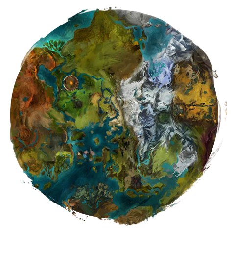

## Başlangıç

Oyuna karakterinizle ilk girdiğinizde, çok kısa bir öğretici bölümünü (bu bölümü geçemezsiniz) yapmanız gerekmektedir. Bundan sonra oyunun her yerine özgürce gidebilirsiniz.

Tyria'nın bir sürü bölgelere ayrılmış kocaman bir haritası vardır. Her alanın kendine özgü bir seviye aralığı mevcuttur, bu nedenden dolayı toplanan veya düşen eşyaların bir seviye sınırı vardır.

Oyunun şu zamana kadar çıkmış iki ek paketi mevcuttur bunlar, _Heart of Thorns_ ve _Path of Fire_'dır. Bunların her ikisi de oyuna birçok yeni bölge ve özellik ekliyorlar, almanızı tavsiye ederim. Durmaplay sitesi üzerinden uygun bir fiyata PoF alabilirsiniz, zaten artık yanında HoT ek paketini de hediye olarak veriyor.

Bir bölgeyi tamamlamak için harita içerisindeki bütün waypointleri, vistaları, poileri, skill puanlarını ve kalpleri yapmanız gerekiyor. Bi bölgeyi tamamlamak güzel ödüllerin dışında size güzel de bi exp verir. Hadi bunlar ne bakalım:

### Kalp

 

Oyuncu olmayan bir karakterin (NPC) yardıma ihtiyacı var. Kalbin etrafındaki alanda görevler yaparak ekranınızın sağ üst tarafındaki çubuğu doldurup görevi tamamlayabilirsiniz. Kalbi doldurduktan sonra, minimap üzerindeki bir sandıkta ödüller bulacaksınız ve karma adı verilen özel bir para birimine sahip olacaksınız. Bu para birimini bazı NPC lerde harcayabilirsiniz.

### Waypointler

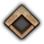 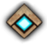

Bir waypointe yaklaştığınızda otomatik olarak açılır ve ilerleyen zamanlarda o waypointe tıklayarak ufak bir ücret karşılığında oraya ışınlanabilirsiniz. Düşmanlar waypointe yakın bir yere saldırırlarsa waypoint geçici bir süreliğine kullanılmaz hale gelebilir.

### Vista

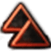 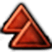

Bulunduğun bölgenin inanılmaz manzarasını gösteren bu noktaya gidebilirsin. Bu noktalara ulaşmak bineksiz biraz zıplama ve hoplama gerektirir ve bazıları cidden adamı kanser eder!

### Hero Point

 

11.seviyeye ulaştığınızda karakter panelinizdeki hero pointleri verip karakterinizi gelişirmek için bu hp leri toplamanız gerekmekte. Bazıları hemen gidip alınabilirken bazıları ise birkaç canavarı tokatlayarak anca alınabilir. Ek paketlerle gelen haritalardaki hp ler size direk 10 puan kazandıracaktır.

### Önemli Yerler (PoI)

 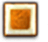

Bu simgeler, kasabalar veya doğa olayları gibi önemli noktaları gösterir. Aktiviteler, olaylar, gizemli koşullar ve sıra dışı karakterler için önemli yerlerdir.

## Arayüz (HUD)

Arayüz oyunda şöyle görünüyor:

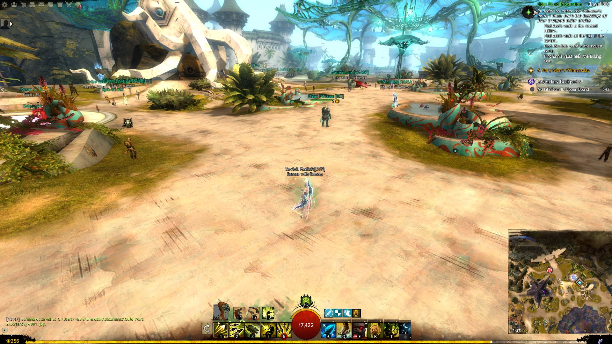

Sağ alt köşede de görebileceğiniz gibi, çokça bakacağınız mini haritamız var. Mini haritanın konumunu değiştirebileceğinizi unutmayın.

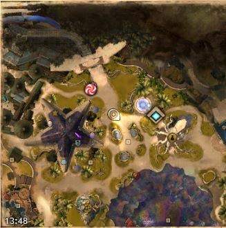

Arayüzün altında skill çubuğu bulunur. Oyun içerisinde skilller 2 ye arılmıştır: silah skilleri ve sınıf skilleri. Sol kısım (1-5) sınıfınıza özel sillah skilleri, sağ kısım (6-0) ise sınıfınıza özel seçilebilir olan sınıf skilleridir. Bu iki skill çubuğunun arasında **Can Barı** ve **Dayanıklılık Barı** vardır. Dayanıklılık barı oyun içerisinde takla attığınızda harcadığınız enerjiyi gösteren bardır. En sağ tarafta ise seçtiğiniz binek görünmektedir. Sağdaki skill barının üzerinde ise Buff ve Debuff lar görünmektedir.

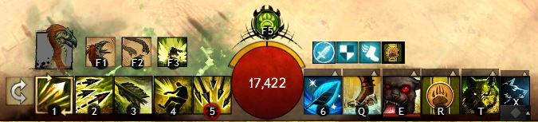
_Örnek bir ranger skill barı_

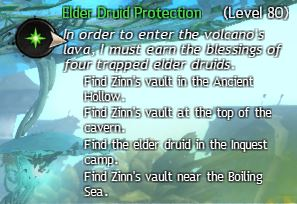

Arayüz'ün sağ üst köşesinde, size **aktif olan hikayenizdeki** doğru yolu gösteren bir pusula mevcuttur. Not: Bu göstergeyi ayarlardan kapatabilirsiniz.

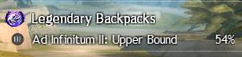

Pusulanın altında favori başarım paneliniz bulunur, buraya başarım sayfasından istediğiniz bir başarımı favoriye ekleyerek bi başarım ekleyebilirsiniz.

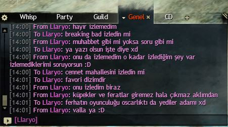

Sol alt köşede sohbet penceresi mevcut.

Ekranın en alt kısmında boylu boyunca exp çubuğu vardır.

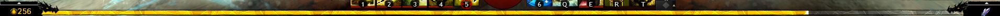

Son olarak, sol üst köşede kısayollarımız var. Soldan sağa doğru sırayla:

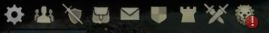

- **Ayarlar**
- **Arkadaş Listesi / LFG**
- **Karakter Paneli**
- **Çanta**
- **Mail**
- **Guild Paneli**
- **WvW Paneli**
- **PvP Paneli**
- **Kapalı Çarşı (Black Lion Trading Company)**

## Cenk Meydanı (Combat)

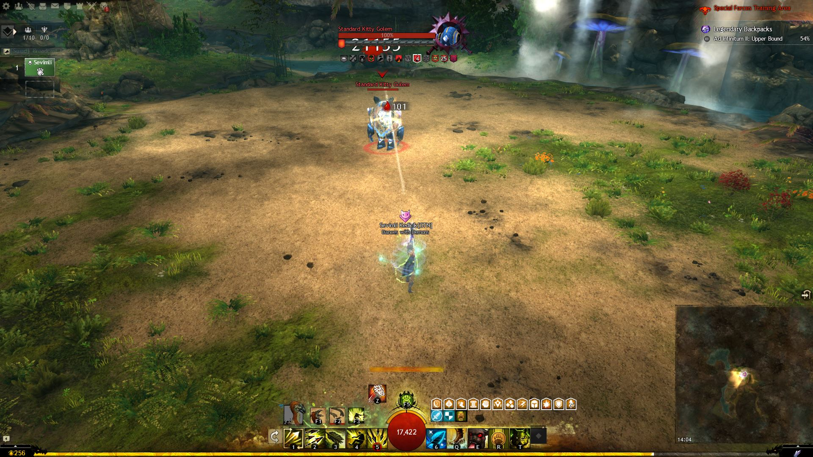

Combat esnasında skillerinizi değiştiremez veya waypointleri kullanamazsınız. Combat durumundan çıktığınızı kolayca anlayabilirsiniz, canınız hızla doluyorsa ve skillerinizi değiştirebiliyorsanız artık cenk meydanından çıkmışsınız demektir.

Eğer bir düşmanı hedef alırsanız düşmanın isminin altında can barı gözükecektir. Eğer can barı sıfıra inerse mantıken öbür dünyayı boylayacaktır.

Şimdi combat ın en önemli kısımlarına biraz bakalım, boon (buff) ve condition (debuff) lar:

### Boonlar

Boon lar, size daha fazla güç veren ve düşmanlarınızı yenmenize yardımcı olan (veya düşmanlarınızın sizi yenmesine yardımcı olan) güçlendirmelerdir. Hem size hem de düşmanlara uygulanabilir, böylece düşmanların boonları olduğunda daha güçlü hale gelirler. Boon lar ve açıklamaları şu şekilde:

-  **Aegis:** Bir sonraki gelen saldırıyı engeller.

-  **Alacrity:** Yetenek dolum sürelerini(cooldown) hızlandırarak, yetenekleri daha sık kullanılabilir hale getirir.

-  **Fury:** Kritik şansını %20 arttırır.

-  **Might:** Verilen hasarı arttırır.

-  **Protection:** Gelen hasarı %33 azaltır.

-  **Quickness:** Skiller ve aktiviteler daha hızlı gerçekleşir.

-  **Regeneration:** Her saniye can kazanırsın.

-  **Resistance:** Condition hasarlarını engeller.

-  **Resolution:** Gelen condition hasarını %33 azaltır.

-  **Stability:** Yere düşmezsin, kimse sana omuz atamaz, çekemez, fırlatamaz, sersemletemez, korkutamaz veya alay edemez.

- 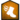 **Swiftness:** Bi [Usain Bolt](https://tr.wikipedia.org/wiki/Usain_Bolt) olmasan da hızını %33 arttırır.

- 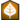 **Vigor:** Enerji yenilenmesini %50 arttırır.

### Condiler

Condiler, boonların tam tersidir. Düşmana hasar vermek için kullanılacağı gibi düşmanlar da sizin üzerinize condi bırakıp sizi sakatlayabilirler. Condi hasarınız **Condition Damage** ve **Expertise** statları ile arttırılabilir. Condiler aşağıdaki gibidir:

#### Hasar Condileri

- 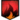 **Burning:** Yakıyosun kardeşim dercesine her saniye adamı yakar.

- 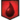 **Bleeding:** Müslüm Baba hayranlarının en sevdiği condidir, her saniye kanama hasarı verir.

-  **Confusion:** Kafası karışan rakip skill kullandığında kendisi hasar alır.

- 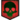 **Poision:** Her saniye zehir hasarı alır ve sağlık yenileme efektleri %33 azalır.

- 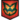 **Torment:** Her saniye hasar verir, hareket ederse bide onun için hasar verir.

#### CC Condileri

-  **Blind:** Bir sonraki saldırının ıskalamasına sebep olur.

- 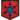 **Chill:** Hareket hızını %66 azaltır ve skill cooldown larını %66 arttırır.

- 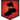 **Cripple:** Hareket hızlı %50 azaltır.

- 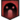 **Fear:** Adamın ödünü patlatır, kontrolü dışında rastgele hareket etmeye başlar ve hareket edemez.

- 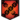 **Immobilize:** Hareket edemez.

-  **Slow:** Skiller ve aktiviteler yavaşlar.

-  **Taunt:** İstemsizce düşmanlara saldırır.

- 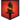 **Weakness:** Enerji yenilenmesini %50 düşürür, Verdiği hasarın %50 sini düşürür.

#### Diğer Condiler

- 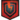 **Vulnerability:** Alınan hasarı ve condi hasarını arttırır.

Condiler zırh veya **Protection** gibi hasar azaltan şeylerden etkilenmezler. Direkt hasar yani Power Damage den ayrılan özelliği budur. 1 saniye aralıklarla hasarı vururlar.

Bazı boon ve condilerde sayılar görebilirsiniz. Bu sayılar o boon veya condinin kaç adet üzerinizde olduğunu gösterir. **Might** ve **Stability** gibi boonlar mesela ne kadar çok birikirse o kadar çok etkili olur. Bu boon veya condileri ne kadar çok verirseniz o kadar çok birikir.

Her zaman dikkat etmelisiniz ki hayatta kalmak ve güzel hasar verebilmek için bu etkileri gözden geçirmelisiniz. Eğer üzerinizde sürekli condi varsa canınız sürekli azalır, bunun için condileri silmeniz veya ortamdan hızla uzaklaşmanız gerekir. Düşmanınızı da hızlıca kesmek istiyorsanız bol bol boon alıp kendinizi güçlendirmelisiniz.

### Enerji

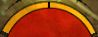

Canınızın üstündeki sarı çubuklar sizin enerji göstergenizdir. Bu çubuk attığınız dodge (takla) lardan etkilenir. Eğer bir saldırıdan takla atarak kaçmak istiyorsanız 1 adet enerji çubuğunuzu harcamanız gerekmektedir.

Dodge atmak çoğu saldırıdan kaçınmanızı sağlar ve cidden oyunun en önemli mekaniklerinden birisidir. Bazı skiller bu göstergeden etkilenmeden dodge atmanızı sağlar. Oyun oynarken dodge atmaktan çekinmeyin ve kendinizi alıştırın, inanın bana baya faydasını göreceksiniz.

### Defiance Bar

Combatın en ama en önemli noktalarından birisi **Defiance Bar** dır. Bu bar genellikle Champion Legendary yaratıklarda görülür fakat bazı Elite ve Veteran yaratıkların da defiance barı vardır. Bu barı yaratığın sağlık barının hemen altında görebilirsiniz. Bu barı kırmak etkinliklerde yaratıkları tokatlarken, zindanlarda, fractalda, raid vs. gibi yerlerde hayati öneme sahiptir.

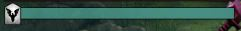

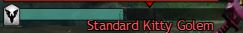

Defiance Barın rengi yukarıdaki gibi turkuaz rengindedir. Bu düşmanın kitle kontrol skillerine(CC Skilleri) karşı bağışıklı olduğunu gösterir. Fakat bu cc skillerini kullanarak bu barı kırabiliriz, Soft CC ve Hard CC ler olmak üzere iki adet CC vardır. Soft CC ler condi hasarı gibi yavaşça düşürürken, Hard CC ler şaaak diye indiriverirler. Gelin bunlar neymiş bakalım:

#### Soft CC ler:

-  Fear
-  Taunt
-  Immobilize
-  Slow
-  Chill
-  Blind
-  Weakness
-  Cripple

#### Hard CC ler:

- 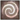 Daze
- 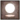 Float
- 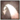 Knokback
-  Knockdown
- 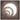 Launch
- 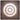 Pull
- 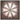 Stun
- Petrified
- Transform
- Freeze
- Ward

Defiance Barını daha hızlı kırmak için genellikle **Hard CC** ler kullanılır. Defiance Bar bir süre sonra eğer etkilenmezse tekardan dolmaya başlar.

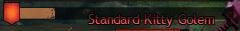

Defiance barı kırıldığında bu şekilde görünür. Kahverengi çubuk zaman içerisinde dolmaya başar ve tamamen dolduktan sonra tekrar turkuaz rengine dönüp tekrar kırılabilir.

Defiance Barı kırıldıktan sonra bilinmesi gereken en önemli şey, düşmanın aktivitesinin sona ermesi ve bazı kitle kontrol efektlerine maruz kalmasıdır. Onlar da şunlar:

 Stun  
 Knockdown  
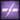 Exposed (5 saniye boyunca %50 ek hasar alır)

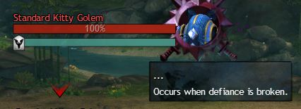

Bu uygulanacak efektin ne olduğunu öğrenmek için defiance barının üzerine mouse ile gelmen yeterli olacaktır. (...) olan yerde hangi efektin uygulanacağını görebilirsiniz.

Bazı yaratıkların defiance barının kırılmaması özel durumları meydana getirebilir. Defiance barının zamanında kırılmaması tük takımı haritadan silip süpürebilir. Bu sebepten dolayı bu barı hızlı bir şekilde kırmak gerekir.

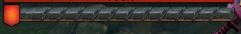

Defiance barının bu şekilde görünmesi, **kilitli** olduğu anlamına gelir ve her türlü CC skiline karşı bağışıklığı olduğunu gösterir.

### Son Çırpınmalar

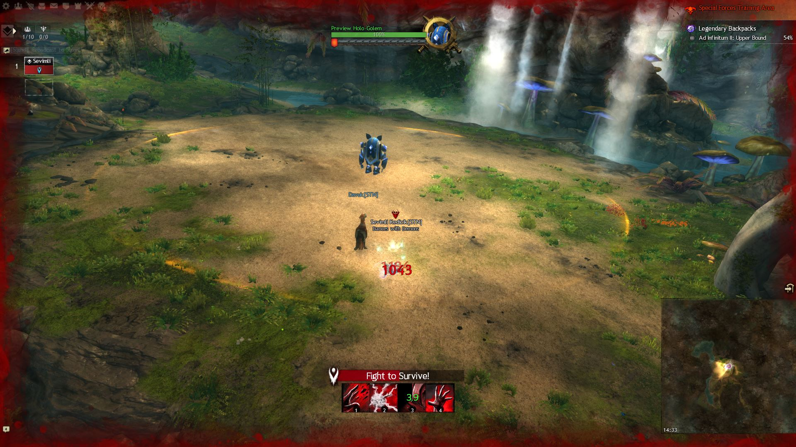

Canınız 0'a ulaştığında, yerden bir şeyler fırlatabildiğiniz, kendinizi iyileştirmeye çalışabildiğiniz birkaç skill açılır. Bu duruma Son Çırpınma (Downed/Last Stand) denir. Her sınıfın kendine özel çırpınma skilleri vardır.

Eğer hasar verdiğin bir düşman ölürse anında ayağa kalkabilirsin veya takım arkadaşların ya da kendin iyileştirme yaparak seni kaldırabilir. Eğer bu durumda da kalan canını tüketirsen tamamen ölürsün ve bi waypointe ışınlanman veya arkadaşlarının seni uzun uzun iyileştirerek kaldırması gerekir.

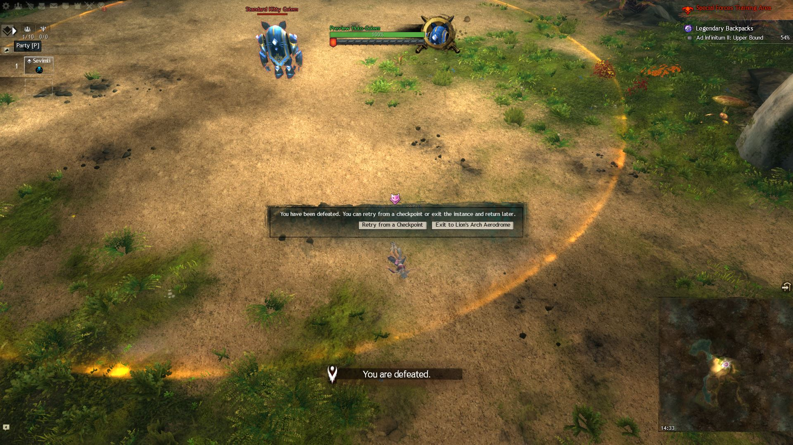

## Attributes

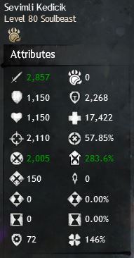

Attribute lar temel olarak sizin statlarınızdır. Ne kadar yüksek olursa efektifliği o kadar artar. Statlar şu şekilde kategorilere ayrılmıştır:

- **Birincil Statlar:** Bu statlar seviye 37 den başlayıp karakter seviyesi ile birlikte artarlar.
- **İkincil Statlar:** Bu statlar 0'dan başlar ve seviyenizden etkilenmezler.
- **Türetilmiş Statlar:** Bu statlar birincil, ikincil statlar, giydiğiniz ekipmanlar ve sınıfınızın özelliklerine göre değer alırlar.

Her birinin ne işe yaradığına bi göz gezdirelim:

### Birincil Statlar

-  **Power:** Doğrudan verdiğiniz hasarınızı arttırır.

-  **Precision:** Kritik şansınızı arttırır.

-  **Toughness:** Zırhınızı arttırır.

-  **Vitality:** Canınızı arttırır.

### İkincil Statlar

-  **Concentration:** Boon süresini arttırır.

-  **Condition Damage:** Condi hasarınızı arttırır.

-  **Expertise:** Condi sürenizi arttırır.

-  **Ferocity:** Kritik hasarınızı arttırır.

- 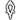 **Healing Power:** İyileştirme gücünüzü arttırır. Ne kadar yüksekse o kadar güzel milleti iyileştirebilirsiniz.

### Türetilmiş Statlar

-  **Armor:** Doğrudan gelen hasarı azaltır. Toughness ve Defense ile artar.

-  **Boon Duration:** Boon verme sürenizi arttırır. Concentration ile artar.

-  **Critical Chance:** Kritik hit şansınızı arttırır. Precision ile artar.

-  **Critical Damage:** Kritik hasarınızı arttırır. Ferocity ile artar.

-  **Condition Duration:** Uygulanan condilerin süresini arttırır. Expertise ile artar.

-  **Health:** Karakterinizin maksimum canını gösterir. Vitality ve sınıf özelliklerinizden etkilenir.

### Özel Statlar

-  **Agony Resistance:** Agony hasarına karşı direncinizi gösterir. Sadece Fractal da işe yarar.

- 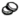 **Gold Find:** Hesap geneli gold kazanım oranınızı gösterir.

-  **Karma Gain:** Hesap geneli karma kazanım oranınızı gösterir.

-  **Magic Find:** Aldığınız loot kalitesinin oranını gösterir. Ne kadar yüksek olursa nadir eşya düşme olasılığınız bir tık daha fazla olur. Hesap genelidir.

-  **XP Gain:** Hesap geneli exp kazanma oranınızı gösterir.

## Karakter Paneli

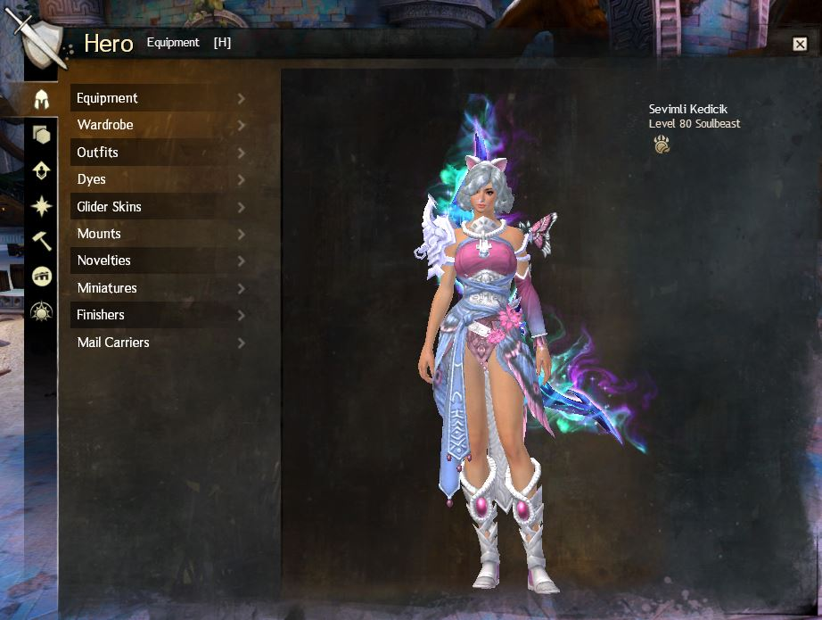

Karakter panelinizle (varsayılan olarak H tuşuna basarak ulaşabilirsiniz) karakterlerinizi yönetip, başarımlarınızı, hikayelerinizi ve mastery puanlarınıza falan erişebilirsiniz. Özet olarak karakter panelinin kısımlarını inceleyelim:

### Ekipman

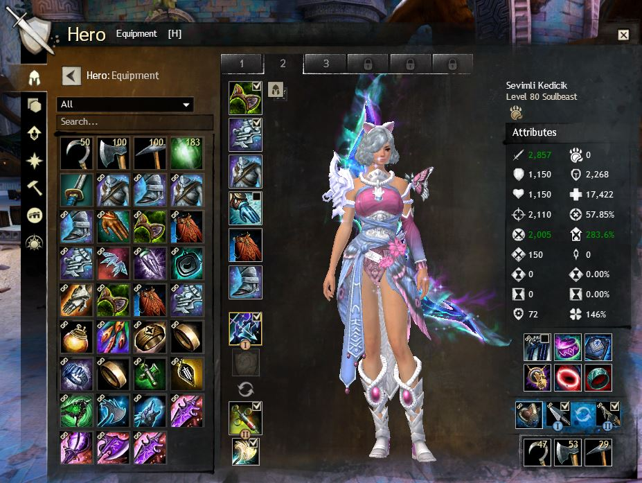

Buradan ekipmanlarınızı görebilir ve değiştirebilirsiniz. Ayrıca statlarınızı da bu panelden görebilirsiniz. Sol kısımda envanterinizde veya diğer ekipman şablonlarınızdaki ekipmanları giyebilirsiniz. Orta ve sağ alt kısım ise üzerinize giymiş olduğunuz ekipmanları gösterir. Üst tarafta sayılar ile belirtilen yerde farklı ekipman dizilimlerinizi çantanızda yer işgal etmeden saklayabilirsiniz.

### Build

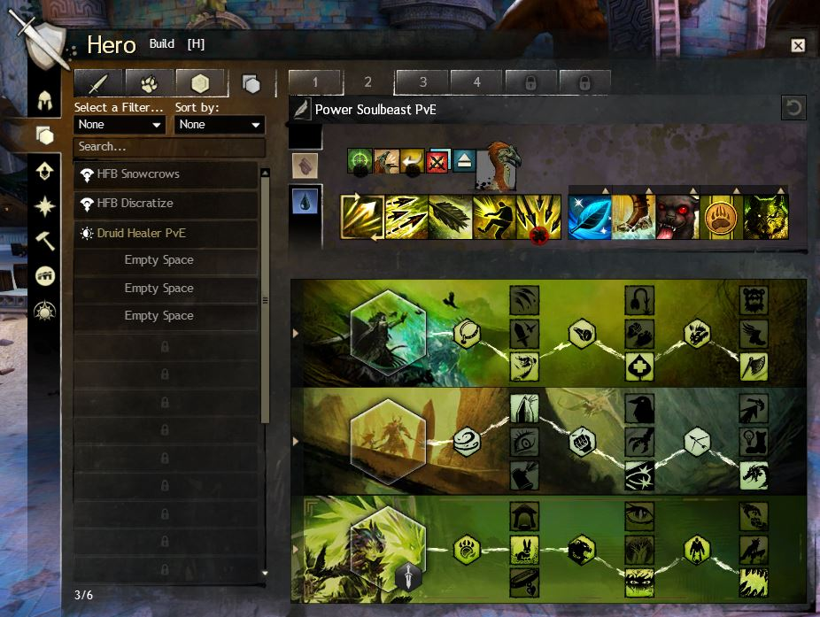
_Ranger build sekmesi_

Bu kısımda, öğrendiğiniz yetenekleri onunla ilgili yapabileceğiniz buildin olduğu sayfayı göreceksiniz. Ekipman sayfasında olduğu gibi burada da şablon olayı mevcut. Birden fazla buildi barındırıp, tek bir tıklamayla bi anda healer olup, bi anda hasar veren bir canavara dönüşebilirsiniz.

### Eğitim

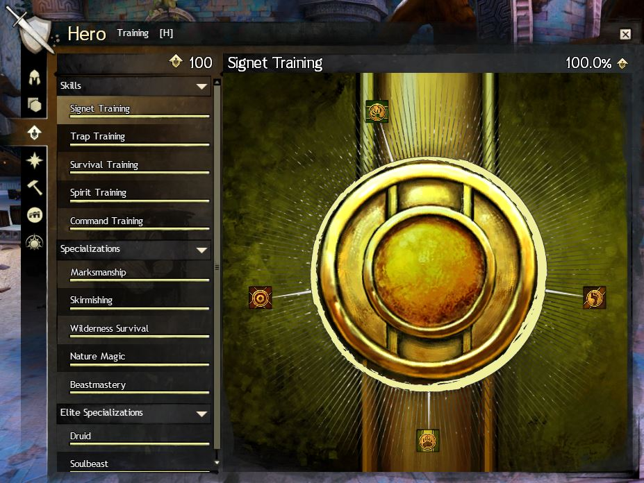
_Ranger training ağacı_

Build kısmında buildinizi ayarlamanız için önce burdan öğrenmeniz gerekmekte. Hero Point denen puanları haritalardan toplayıp buradan dağıtabilirsiniz. Hangisine vermeliyim diye çok düşünmenize gerek yok hepsini açabildiğiniz için geri dönüşü olmayan bir yanlış yapmazsınız merak etmeyin.

### Hikayeler

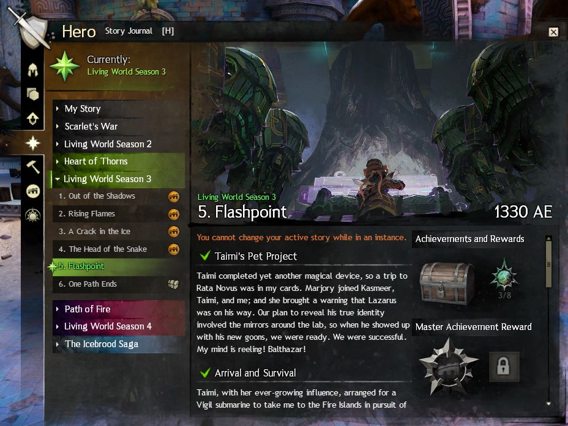

Hikayeler kısmından tamamladığınız veya yarım olan hikayelerinize erişebilirsiniz.

- **My Story**, karakterinizin hikayesini oynadığınız her 10 seviyede bir gelen hikaye.

- **Scarlet's War**, aslında Living World Season 1 dir fakat artık oynanabilir değildir.

- **Living World Season 2**, HoT ek paketine kadar olan olayların olduğu hikaye.

- **Hear of Throns**, oyunun ilk ek paketinin hikayesi, ek paketiniz varsa direkt oyanayabiliyorsunuz. Glider (Süzülgeç) özelliğini açabildiğiniz hikaye.

- **Living World Season 3**, HoT sonrası olan olayların olduğu hikaye.

- **Path of Fire**, oyunun ikinci ek paketinin hikayesi. Binekleri bu hikayeyi oynayarak elde ediyoruz.

- **Living World Season 4**, PoF sonrası olayların olduğu hikaye.

- **The Icebrood Saga**, Aslında kendisi Charr görünümlü LS5 dir.



### Crafting

Burdan karakterinizin sahip olduğu meslekleri görebilirsiniz. Craft istasyonlarına gidip de craftınızı da orada yapabilirsiniz. Her karakter aktif olarak 2 adet mesleğe sahip olabilir. Aktif olarak ne demek diyecek olursan, aynı adna iki meslekte uzmanlaşmak demek. Üçüncü birini öğrenmek istediğinde birini seçip onun yerine alman gerekir veya gem strore da ek bi meslek slotu daha alabilirsin (hiç tavsiye etmem).

Tavsiye etmememin sebebi şu örnek olarak 2 adet son seviye mesleğiniz varsa birini feda edip yeni meslek öğrendiniz, sonra tekrar eski mesleğinizi geri aldığınızda seviye olarak gene son seviyeden devam ediyor, ilerlemeniz silinmiyor. Veya farklı karakterlere 2 şer 2 şer tüm meslekleri alabilirsiniz.

Yukarıda da dediğim gibi craft yapmak için bi craft istasyonuna gitmeniz gerekiyor. Ama korkmayın tüm eşyaların çantanızda olmasına gerek yok, materyal deposu denen bi olay var orda malzemelerinizi biriktiriyorsunuz ve ordan direkt olarak craft için malzemelerinizi kullanabiliyorsunuz.

### Achievement Paneli

Başarım sekmesinde tamamlamış olduğunuz (veya tamamlamadığınız) başarımları görebilirsiniz. Ayrıca günlük giriş ödüllerini ve neresinde olduğunuzu görebilirsiniz. Günlük giriş ödülleri en sonuncuya ulaştıktan sonra başa döner. Ve en altta hesap bonuslarınızı görebilirsiniz:

- **Gold Find:** Hesap geneli gold kazanım oranınızı gösterir.  
- **Karma Gain:** Hesap geneli karma kazanım oranınızı gösterir.  
- **XP Gain:** Hesap geneli exp kazanma oranınızı gösterir.  
- **Magic Find:** Aldığınız loot kalitesinin oranını gösterir. Ne kadar yüksek olursa nadir eşya düşme olasılığınız bir tık daha fazla olur. Hesap genelidir.

Başarımlarda en önemli olanlardan birisi günlük başarımlardır. Oyunun her içeriği için (PvE, PvP, WvW) günlük başarımlar vardır. Bunların hepsinden herhangi üçünü yaparsanız günlük başarım tamamlanır ve size 2 gold + 10 başarım puanı verir. Çok zor değil zaten yapması, günlük yapmanızı tavsiye ederim.

Her şeyden önce pasif olarak aylık 60 gold getirisi oluyor ve şöyle bir şey var oyun her 5.000 başarım puanında bir size 400 gem veriyor bunun için de başarım puanınızı günlük olarak arttırmanın güzel bir yoludur. Sürekli başarım kasmasanız bile, zamanınız varsa günlük yapın pişman olmazsınız.

### Masteries



_Central Tyria - Fractal Attunement Mastery Ağacı_

Ek paketlere sahipseniz bir karakteriniz 80.seviyeye ulaştığında buranın kilidi açılacaktır. Bu puan hesap geneline aittir, bu yüzden başka bir karakterinizle 80 level olduğunuzda kaldığı yerden devam eder.

- **Central Tyria:** Bu mastery ağacı ek paketlerden önceki core Tyria haritalarından exp ve mastery puanlarını kasabileceğiniz ağaçtır. Pact Commander, Legendary Crafting ve Fractal geliştirmeleri vardır. Tavsiye olarak **ilk Fractal**, sonrasında **Pact Commander** ağacını fullemenizi tavsiye ederim. Fractal yapmayacaksanız Pact Commander a öncelik vermeniz daha mantıklı olur, sebebi ise oto loot özelliğini açıyor.

- **Heart of Throns:** HoT haritalarında kasabileceğiniz bu ağaçta, süzülgeç (glider), görünmez cenavarları görme, zehir bağışıklığı, vs. gibi güzel özellikleri açabiliyorsunuz. İlk olarak glider kısmından gitmenizi tavsiye ederim.

- **Path of Fire:** PoF haritalarında kasabileceğiniz bu ağaçta, binekler ve bu bineklerin geliştirmeleri vardır. Tüm binekleri açtıktan sonra hepsini en az üçüncü seviye yapmanızı tavsiye ederim.

- **Icebrood Saga:** Icebrood storysi ile gelen bu ağaçta strike geliştirmelerinden, icebrood haritalarındaki geliştirmeleri açabilirsiniz.

Masteryleri açmak için önce o mastery nin seviyesini kasıp sonrasında topladığınız mastery pointleri harcayarak seviye atlatabilirsiniz.

## Seviye Kasmak

Guild Wars 2'de seviye sınırı 80'dir. 80.seviyeden sonra seviye barını her doldurduğunuzda size [spirit shard](https://wiki.guildwars2.com/wiki/Spirit_Shard) isminde bir para birimi ([Mystic Forge](https://wiki.guildwars2.com/wiki/Mystic_Forge) için kullanılan bir para birimi) verir. Eğer ek paketleriniz varsa bu seviyeler öncelikli olarak mastery seviyelerinize gider.

Oyunun en başında asıl amacınız son seviyeye ulaşmak olsun. Bunu yapmanın bir sürü yolu var, etkinlikler, harita tamamlama, crafting, pvp vs. gibi oyunun içerisinde genel manada yaptığınız her şeyden seviye kazanırsınız. Haritalardaki turuncu renkli Dinamik Etkinlikleri kaçırmayın ve her 10 levelda bir hikaye görevinizi yapın, bu sayede efsane bir hikayenin de baş rolü olmuş olursunuz.

Benim tavsiyem hepsinden biraz biraz yapmanız olur. Dinamik eventlar, 10 seviye görevleri ile hızlıca ilerleyebilirsiniz. Eşya konusunda da kafanızı çok yormanıza gerek yok, 80 olasıya kadar oyunun size verdiği eşyalardan sayıları daha yüksek olanı giyip geçin direkt. 80 olasıya kadar paranızı boşa harcamayın.

Oyundaki ilk hedefiniz 80 seviye olmak olsun. 80 olasıya kadar hem karakterinizi hem de oyunun mekaniklerini yavaş yavaş öğrenmiş olacaksnız. 80 olmadaz zindanlara girmenizi **TAVSİYE ETMEM**. Giren oyuncular genellikle 80 seviye olduklarından size atar yapabilirler. Ama illaki ben yapmak istiyorum derseniz tabiki de yapabilirsiniz ama seviyenize uygun zindanlara girdiğiniz sürece.

Bunun dışında, /map kanalı daha arkadaş canlısı ve yardım severdir oradan yardım isteyebilirsiniz veya guildinize sorabilirsiniz yardım için.

Zaten daha siz haritayı tamamlamadan, hikayenizi bitirmeden 80 olacağınızdan dolayı korkmanıza gerek yok. Asıl olay 80 den sonra başlıyor kendinizi hazırlayın!

## Toplayıcılık

Guild Wars 2'de 3 çeşit toplanabilir materyal vardır, bunlar:

### Metal (Kazma kullanılır)

_Queensdale haritasında toplama yapan bir köylü_

### Odun (Balta kullanılır)

_Queensdale haritasında toplama yapan bir köylü_

### Bitki (Orak kullanılır)

_Queensdale haritasında toplama yapan bir köylü_

Her haritanın kendine özel seviyesi vardır, bu sebepten dolayı o haritadan topladığınız materyaller de haritanın seviyesine göre olur. TP (Trading Post)'de fiyatlar sürekli değiştiğinden en üst seviye materyal en pahalısı anlamına gelmez, bu nedenden dolayı denk geldiğiniz her şeyi toplayın.

Her toplama aletinin kendine özel bir kullanım sayısı vardır. Tamamen kullandığınızda gidip bir tane daha almanız gerekmekte ama merak etmeyin sudan ucuz şeyler bunlar. Sürekli satın al satın al ile uğraşmam ben üşengeç bir insanım diyorsanız gem store dan **Unbreakable Gathering Tools** eşyasını alabilirsiniz. İndirimli daha ucuza geleceğini unutmayın.

## Dungeon/Fractal/Strike/Raid

Guild Wars 2, kendine saygı duyan her MMO oyununda olduğu gibi Dungeon ve Raidlere sahiptir. Çoğu MMO dan bildiğiniz şeylerdir belki ama gelin yakından bir bakalım.

### Dungeon (Zindan)

_Ascalon zindanının giriş kapısı_

Zindanlar, harita üzerinde  Kapı simgesi şeklinde görünürler. Zindanlara 5 kişi parti halinde girilir. Guild Wars 2'de şu an 8 zindan mevcuttur:

1. **Ascalonian Catacombs (level 35)**
2. **Caudecus’ Manor (level 45)**
3. **Twilight Arbor (level 55)**
4. **Sorrow’s Embrace (level 65)**
5. **Citadel of Flame (level 75)**
6. **Honor of the Waves (level 80)**
7. **Crucible of Eternity (level 80)**
8. **The Ruined City of Arah (level 80)**

Yukarıdaki görselde de görebileceğiniz üzere zindanların iki adet modu vardır, **hikaye modu** ve **keşif modu**. **Hikaye modu** o zindanın hikayesini anlatır ve tek bir yol vardır ve keşif moduna göre daha kolaydır. **Keşif modu** ise hikaye moduna göre daha zor olur ve seçebileceğiniz yollar olur (genellikle 3-4 adet) ve ödülleri daha fazladır. Keşif moduna girebilmek için önce hikaye modunu yapmalısınız veya hikaye modunu yapmış birisi sizin yerinize o zindanı açabilir.

Tüm zindanların tüm yollarını yapmak size başarım olarak ödüller verecektir. Ek olarak **Dungeon Frequenter** başarımı sayesinde, birbirinden farklı 8 adet zindan yolunu her tamamlayışınızda size 5 gold ve seçeceğiniz bir zindanın parasından 150 tane vermektedir.

Zindanlara girecek birilerini bulmak için, guildinize yazabilir, /map kanalını kullanabilir ya da LFG yi kullanabilirsiniz. Başlangıçta zindanlara 5 kişi girmek daha mantıklı bir seçim olur. İlerleyen zamanlarda tek başınıza yapmayı deneyebilirsiniz.

Her zindanın kendine özel bir para birimi vardır. Bu para birimleriyle o zindana özel silahlar, zırhlar ve taşlar alabilirsiniz. Zindan ödülleri haftalıktır, bir zindanın bir yolundan haftada sadece 1 kere ödül alabilirsiniz.

### Fractal

_Fractal lobisi_

Fractallar, kendine has mekanik ve stratejilerin dışında ek zayıflatma etkilerine sahip 5 kişilik 80 seviye zindanlardır. Fractalı farklı kılan şeylerden birisi de Agony dir. Agony radyasyon gibi agony direnci veren eşyayı ekipmanlara takmadığınız sürece size sürekli hasar verecektir. Fakat korkmayın ilk 0-25 seviye fractallara AR (Agony Resistance) olmadan girebilirsiniz.

AR oyun sonu eşya seviyesi olan Ascended Ekipmanlara (oyun sonu eşyaları) takılabilir. Bu sebepten dolayı fractalda ilerleyebilmek için ascended set yapmanız gerekmektedir. 150 AR ile en son seviye fractala girebilirsiniz, dilerseniz üzerinizdeki AR yi daha da arttırabilirsiniz.

Fractalda şu anlık toplamda 100 adet seviye bulunmaktadır (SAO izleyenler heyecanlanır).

- 0-25 arası Tier 1
- 26-50 arası Tier 2
- 51-75 arası Tier 3
- 76-100 arası Tier 4
 
olmak üzere dörde ayrılır. Bazı fractallar **CM (Challange Mode)** moduna sahiptir. Bu modlar daha zorlayıcı ve ödülü de ona göre fazla olan fractallardır. Genellikle 100, 99 ve 98 seviye fractalların CM modu yapılır.

Fractal ödülleri günlüktür, daily fractal ödüllerini her gün girerek alabilirsiniz. Resimde de göreceğiniz üzere solunda mor işaret olan fractallar günlük fractallardır. T4 de yaptığınız bir daily ile hem T4 hem de T3, T2, T1 daily ödüllerini alabilirsiniz.

### Strike Görevleri

Oyuna Icebrood Saga ile eklenen bu görevler zindanlardan zor raidlerden kolay olup zindan raid arası köprü niteliğinde görevlerdir. Eğer raidlere girmek istiyorsanız strike görevleri güzel bir başlangıç olacaktır. 80 seviye olduğunuzda haritadan [Hall of Monuments](https://wiki.guildwars2.com/wiki/Hall_of_Monuments) mekanını bulup hemen ışınlanabilirsiniz.

Çok fazla olmamakla boss lara özel mekanikleri mevcuttur. Günlük olarak dünülüp günlük ödüller alınabilir. Yeni 80 olmuş arkadaşlar için Ascended eşya elde etmek için çok güzel bir yoldur. Günlük ödüllerin dışında sınırsız olarak kristal kazanabilir ve bu kristaller sayesinde istediğiniz ascended zırh veya silahı alabilirsiniz.

Ek olarak Skyscale bineği kasanlar için de LS4 harita paralarını buradan kazandığınız bir materyal ile alabilirsiniz. Dragonfall dan ascended aksesuar almak için de bu LS4 paralarını kullanabilirsiniz.

### Raid

Raidler Hot ve PoF paketi ile beraber kullanıma açılırlar. 10 kişilik bir ekiple, belirli sınıflara ve buildlere ihtiyaç duyulur. Oyunda öğrenmesi ve ustalaşması zor içeriklerden birisidir.

Raidlere girmek için ille de ascended eşyaya ihtiyacınız yoktur, metaya göre hazırlanmış güzel bir exotic build ile de girlebilir, fakat ascended girmek daha iyi olur. Önce strike yapıp karakterinizi öğrenmeden girişmenizi pek tavsiye etmem, başlamak için guildimize gelip bizden destek isteyebilirsiniz, düzenli raid trainingleri organize etmekteyiz.

Raidler oyun içerisinde **Wing** olarak adlandırılır. Oyunda şu anda 7 adet wing bulunmaktadır:

1. **Spirit Vale (W1)**
2. **Salvation Pass (W2)**
3. **Stronghold of the Faithful (W3)**
4. **Bastion of the Penitent (W4)**
5. **Hall of Chains (W5)**
6. **Mythwright Gambit (W6)**
7. **The Key of Ahdashim (W7)**

## Guildler

Şimdi sosyalleşme zamanı. Demek istediğim, tek başına oynayacaksan MMO oynamanın anlamı ne? Oyunda birçok guild mevcut ve her hesap toplamda 5 adet guilde girebilir fakat aynı anda sadece 1 tanesini temsil edebilir. Bu temsil etme olayını guildin solundaki tike tıklayarak yapabilirsin.

Guild görevleri insanlarla sosyalleşmek ve guild parası kazanmak için çok güzel aktivitelerdir. Hem guilde hem de katılımcıya faydası vardır. Bulunduğunuz guildin görevlerini kaçırmayın.

Bizim guilde gelmek isterseniz de [Discord](http://discord.stancona.org/) sunucumuza gelip, guilde katılmak istediğinizi belirtmeniz yeterli olacaktır.

## Ekipman

Guild Wars 2'de ekipmanlar üç ana parçaya ayrılır: Zırhlar, Silahlar ve Aksesuarlar. Her birini bi inceleyelim:

### Zırhlar

Oyunda zırhlar 3 kategoriye ayrılmıştır: Light, Medium ve Heavy. Aşağıdan hangi kategorileri hangi sınıfların kullandığına bakabilirsin.

| ***Light***  | ***Medium*** | ***Heavy*** |
| ------------ | ------------ | ----------- |
| Elementalist | Engineer     | Warrior     |
| Mesmer       | Ranger       | Thief       |
| Necromancer  | Guardian     | Revenant    |

Bu üç tür birbirinden farklı zırh değerlerine sahiptir.

Zırhlar 6 parçaya ayrılır:

1. **Headgear**
2. **Shoulders**
3. **Chest**
4. **Glove**
5. **Leggings**
6. **Boots**

Oyunda yere düştüğünüzde veya öldüğünüzde zırhınız hasar alır. Bunu nerden görebilirim diye soracak olursan can göstergesinin sağ altında turuncu bir kalkan işareti belirir. İşte o göründüğünde zırhınızı tamir etmeniz gerekmektedir. Tamir için bi örs bulmanız yeterli:

Fazla endişelenmeyin, tamirat yapmanın bi ücreti yok.

### Silahlar

Her sınıf en fazla 2 adet silah setine sahip olabilir ve combat sırasında bu silahlar arası geçiş yaptığınızda 9 saniyelik bir beklemeye girer. Eğer combatta değilseniz istediğimiz gibi değiştirebilirsiniz. Silahlar 3 ana türe ayrılır: Ana Silah, İkincil Silah ve Su Altı Silahları.

**Ana Silah**, tek el bir silahsa 1-3 arası eğer çift el bir silahsa 1-5 arası skillerinizi size verir. Çift el bir silahı kuşanırsanız o tek silah iki slotu da kaplar. Yanına ikincil bir silah takamazsınız.

**İkincil Silah**, eğer elinizde tek el bir silah varsa ikinci elinize aldığınız silaha denir. 4-5 skillerini açar.

**Su altı silahları** da su altında kullanılan silahlardır.

### Aksesuarlar

Aksesuarlar, zırhlara benzeyen her sınıfta aynı olan mücevherlerdir. 4'e ayrılırlar:

1. **2x Ring**
2. **2x Earring**
3. **1x Amulet**
4. **1x Back item**

Bazı aksesuarların açıklamasında **"Unique"** ibaresi bulunur, bu ibare olan bir aksesuardan sadece bir adet kullanabilirsin. Örnek olarak üzerinde unique yazan 2 aynı yüzüğünüz varsa ikisini aynı anda kullanamazsınız.

Şimdi en kötüden en iyiye doğru ekipmanların nadirliklerini inceleyelim:

- **Basic**
- **Fine**
- **Masterwork**
- **Rare**
- **Exotic**
- **Ascended**
- **Legendary**

Lütfen şunu unutmayın Ascended ile Legendary arasında stat farkı yoktur, farkları ise şu Legendary ekipmanların kendine özgü güzel görünümleri vardır ve statları çok rahat bir şekilde değiştirilebilir. Oyunun başlarında legendary ekipmanları pek kafanıza takmayın.

Oyunun başında ille de ascended diye ölmenize de gerek yok tabi ki gerekli ve üst seviye bir stat ama exotic ile ascended arasındaki güç farkı sadece %5 dir. Exotic set ile strike ve raid yapabilirsiniz. Tabi biraz daha efor sarf etmeniz gerekiyor.

### Prefix (Statlar)

_Örnek bir Harrier statı_

Guild Wars 2'de ekipmanların belirli stat kümeleri vardır, bunlara detaylı olarak [buraya](https://wiki.guildwars2.com/wiki/Attribute_combinations) tıklayarak ulaşabilirsiniz. Örnek olarak, Berserker statı size +Power, +Precision, +Ferocity verir. Verdikleri aynı olup da sayıları farklı olanlar da vardır mesela Assassin statı berserker ile aynı statları size verir fakat Precision statını daha fazla olarak verir. Oyun sonu içerikte oynamak istediğiniz role göre stat seçimi çok önemlidir.

## Binekler



Oyun ilk çıktığından beri istenen ve PoF ile hayatımıza giren şeylerdir binekler. PoF paketi ile geldiği için maalesef ücretsiz oyuncular ve sadece HoT a sahip olan insanlar binekleri kullanamıyorlar. Oyunda şu anda kullanılabilir olarak 8 adet binek mevcuttur ve hepsinin kendine has özellikleri vardır. Gelin bunları inceleyelim:

### Raptor

Raptor, uzun mesafeleri atlayarak geçebilen bir binektir. Kolay ulaşım ve farmlarda genelde kullanılan binektir.

### Springer (Tavşan)

Bu dev tavşanımızın tatlılık oranı zıplamasıyla eş değerdir. Çok yükseklere zıplayarak yüksek yerlere daha da rahat erişebilirsiniz.

### Skimmer

Yerden ayağınızı kesen ilk bineğiniz olan bu binek hevesleri az kırmakla beraber baya da işe yarıyor. Kendisi karada böyle gitmekle beraber su üzerinde ek bir hız kazanarak bu şekilde gidebiliyor. Bunun yanı sıra kızgın çöl ve bataklık gibi size zarar verebilecek zeminlerden ayağınızı değmeden zarar almadan gidebilmenizi sağlar. Ve yeni gelen özelliği ile beraber bu bineği geliştirirseniz su altında da bu binekle gezebilirsiniz!

### Jackal

Kendisi çok efsane bir binek olan çakal çok güzel özelliklere sahiptir. Kısa mesafe ışınlanma yapabilir daha çok sıçrama gibi. Fakat özel kılan noktası şu sıçrama esnasında gelen bütün hasarlardan kaçınabilirsiniz. Ayrı olarak bu sıçrama hareketi momentumu sıfırlamak için de kullanılabilir. Örnek olarak yüksek bir kuleden bu binekle aşağı atladığınızda düşüş esnasında sıçrayabildiğiniz gibi yere değmeden bir kere sıçramanız momentumu sıfırlayacağından düşmeden hiç hasar almazsınız. Ayrıca kum portallarından da bu binek sayesinde geçebilirsiniz.

### Griffon

_Şahgaga_

İşte geldik benim favorilerimden birine. Çoğu kişi bu bineği gömse de benim ayrı bir bağım var bu binekle. Kendisi oyunun en hızlı bineğidir (kullanmayı öğrendikten sonra). Bu bineğin özelliği şudur gelişmiş bir glider gibidir, yükseklik kazanamazsınız (uğraşarak kazanabilirsiniz tabi) fakat yüksek bir yerden dalış yaptığınızda bi anda oyunun en hızlı bineğine dönüşür. Havada asılı kalamaz ve bir yere değdiğinde hızınızı kaybedersiniz, üzerine çalışmanız gerekmektedir.

### Roller Beetle

_Nissan 350z_

Geldik en favorilerimden diğeri olan şu tatlış böceğimize. Kendisi oyunumuzun en tokyo drift özelliğidir. Yerlerin griffonu dur kendisi, çok aşırı hızlanabilir ve drift yapabilirsiniz. Hatta arkadaki pisti bu arkadaşa özel hazırlıyoruz diyebilirim. Efsane yarışlar yapılabiliyor bu arkadaşla. Ama bu bineği alabilmek için LS4 Long Live The Lich hikayesine sahip olmanız gerekmektedir.

### Skyscale

Bu göğü delen abimiz oyuna LS4 hikayesinin sonunda eklenmiştir ve bu abimizle yükseklik kazanabilir, havada asılı kalabilir ve duvarlara tutunabilirsiniz. Bu bineği alabilmek için tüm LS4 bölümlerine sahip olmanız gerekmektedir. Ve oldukça uzun başarım silsilesi sizi bekliyor. Ama merak etmeyin çok eğlenceli spoiler vermeyeyim.

### Warclaw

Bu arkadaş WvW için çıkmış ilk ve tek binektir. Kendisinin full potansiyelini wvw haritalarında görebilirsiniz (yerdeki düşmana finisher atabilir, kapıları kırabilirsiniz, vs.) fakat yine de pve de kullanılabilir ama pek bi işe yaramıyor pve de. Açmak ve geliştirmek için wvw oynamalısınız.

## Meslekler

Oyunda 9 farklı meslek bulunuyor bunlar:

1. **Armorsmith**, Hevy Zırhları üretmek için
2. **Leatherworker**, Medium Zırhları üretmek için
3. **Tailor**, Light Zırhları üretmek için
4. **Weaponsmith**, yakın mesafe silahları ve kalkanları üretmek için
5. **Huntsman**, mesafeli silahları ve ikincil silahları üretmek için
6. **Artificer**, Staff, Scepter, Focus ve Trident üretmek için
7. **Chef**, yemek üretmek için
8. **Jeweler**, aksesuarları üretmek için
9. **Scriber**, Guild Hall da kullanılan dekorasyonları üretmek için

Oyun sonu eşyalarını (Ascended, Legendary) üretmek için mesleklerinizin son seviye olması gerektiğini unutmayın. Her karakterde 2 adet meslek alabilirsiniz, bu sayıyı gem store dan arttırabilirsiniz.

## Banka

Tüm karakterlerinizle erişebileceğiniz bankanız en başta 30 slot olarak gelir. Bu slotu gem store dan arttırabilirsiniz.

Bankanızın diğer bir sekmesinde materyal deposu bulunuyor, kırdığınız eşyaları deposit ederek buraya gönderebilir ve craft esnasında envanterinizde olmasa bile malzemeleri kullanabilirsiniz. Her materyalden toplam 250 adet burada saklayabilirsiniz. Gem store dan bu depolama limitini arttırabilirisniz.

Bankanızın bir diğer sekmesinde de gardırop bölümü bulunur. Burası skinlerini açtığınız ekipmanları gösterir. Bu skinleri zırhlarınıza veya silahlarınıza Transmutation Charge yardımıyla giydirebilirsiniz. Bir ekipmanın skinini açmak için onu kullanmanız, kırmanız veya mystic forge a atmanız gerekmektedir.

## Black Lion Trading Post (Kapalı Çarşı)

Guild Wars 2'nin kapalı çarşısına hoş geldiniz. Burada karakterlere ve hesaplara bağlı olmayan her şeyi alıp satabilirsiniz. 1.Jenerasyon Legendary silahları bile alabilirsiniz! Materyal ve ihtiyacınız olan diğer şeyler için burada baya zaman geçireceksiniz.

TP de bir mal için alış teklifi verebilir ya da en düşük satış fiyatına alabilirsiniz. Aynı şekilde istediğiniz bir teklife ürün koyabilir veya en yüksek ücreti verene satabilirsiniz. TP işlemlerini oyunun her yerinde yapabilirsiniz fakat paranızı ve ürününüzü almak için en yakın TP görevlisine gitmeniz gerekmektedir.

## Gem Store

_ArenaNet'in ekmek kapısı_

Gem para birimini harcayabileceğiniz bu yerden hiçbir şekilde sizi oyunda ileri götürecek bir şey alamazsınız yani oyun p2w değildir. Buradan hesap geliştirmeleri (banka slotu, karakter slotu, vs.), Zırh görünümleri, Kostümler, Binek görünümleri vs. alabilirsiniz.

Oyunda gem elde etmenin 3 yolu vardır:

1. **Gerçek parayla satın alabilirsiniz**
2. **Her 5.000 başarımda bir ödül olarak alabilirsiniz**
3. **Oyun içi goldu geme çevirebilirisniz**

Yukarıda da gördüğünüz gibi belirli gem miktarlarının gold karşılığı görebilirsiniz. Bu miktardan daha az veya daha belirli bir sayıda gemi gold yardımı ile alacaksanız **Custom Exchange** tuşu yardımı ile 1 gem bile alabilirsiniz direkt.

Bu rehberimizden de bu kadar, sonraki rehberlerde görüşmek üzere. Aklınıza takılan bir konu olursa [Discord](http://discord.stancona.org/) sunucumuza gelip sorabilirsiniz veya yorum bırakabilirsiniz. İyi oyunlar bol şanslar.

_Referanslar:_  
[https://www.guildwars2.com/en/new-player-guide](https://www.guildwars2.com/en/new-player-guide)  
[https://altarofgaming.com/guild-wars-2-beginners-guide-welcome-to-tyria/](https://altarofgaming.com/guild-wars-2-beginners-guide-welcome-to-tyria/)
